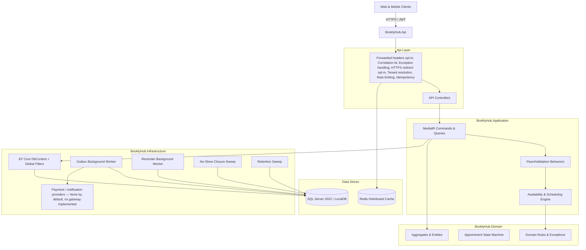

# BooklyHub — Production-Grade Multi-Tenant Booking & Appointment SaaS

[](https://dotnet.microsoft.com/)
[](https://www.microsoft.com/sql-server)
[](https://redis.io/)
[](https://github.com/dante127/BooklyHub/actions/workflows/ci.yml)
[](https://opensource.org/licenses/MIT)

**BooklyHub** is an enterprise-ready, modular multi-tenant appointment and scheduling SaaS backend built in **.NET 10** using ASP.NET Core Web API, Entity Framework Core, SQL Server, Redis, and CQRS with MediatR.

It is designed to power scheduling for diverse appointment-based businesses:
- 🏥 **Medical & Dental Clinics** (multi-doctor schedules, treatment rooms, equipment reservations)
- 💇 **Beauty Salons & Barbers** (stylist availability, custom service durations, chair allocations)
- 🏋️ **Fitness Studios & Personal Trainers** (recurring slots, multi-location gyms)
- ⚖️ **Professional Consultants & Tutors** (buffer times, advance notice, automated reminders)

> **Deploying it, or handing it to a client?** Start with [`docs/DEPLOYMENT.md`](docs/DEPLOYMENT.md) — the handover
> document. It lists every setting with what it costs, the migrate-and-seed procedure, what the health endpoints
> actually mean, retention and backup, a smoke checklist, and §10: *what a client cannot do with this build yet*.
> That last section is deliberately in the handover, not in a footnote — three of its items (no payment gateway,
> no message delivery, no way to add a tenant) change what a client can be promised.
> Every number quoted below was measured against this repository, and [`docs/AUDIT-STATUS.md`](docs/AUDIT-STATUS.md)
> records which finding each change answers.

---

## 🌟 Key Architectural Highlights

- **Clean Architecture & Modular Monolith**: Strict dependency boundaries (`Domain` ➔ `Application` ➔ `Infrastructure` ➔ `Api`). Zero third-party leakages in Domain.
- **Strict Multi-Tenancy Isolation**: Tenant context extracted automatically via middleware; dynamic EF Core Global Query Filters keep a query from seeing another tenant's rows. Verified against real SQL Server, including a spoofed `X-Tenant-Id` header on a JWT whose claim names a different tenant (still `404`).
- **Deterministic Interval-Based Availability Engine**: Evaluates staff shifts, custom breaks, location holidays, availability exceptions, service buffers (before/after), and shared physical resources without brute-force minute-by-minute iterations. The preview and the booking walk the same rule set, so an offered slot and a booked slot cannot disagree.
- **Atomic Concurrency & Double-Booking Guard**: Transactional serialization with SQL Server application locks (`sp_getapplock`) over three booking families — location-wide, per-staff calendar, per-appointment payment — plus locks for the outbox processor and each tenant's no-show sweep. A single availability guard both previews and books. Verified under race conditions against real SQL Server: 5 clients on one slot, 4 staff on one treatment room, and a recurring series whose resource holdings must be visible to the next booking.
- **Set-Based Reads, Counted By The Suite**: The critical read paths use projections and SQL aggregations, and the query count is an assertion rather than a hope: one page of appointments costs ≤ 2 statements, the multi-metric dashboard ≤ 5, and a full availability day a fixed number however many staff are candidates. An interceptor counts the statements, so a regression to per-row loading fails a test instead of arriving quietly.
- **Idempotency Replay Protection**: `Idempotency-Key` middleware with Redis + database caching, so a state-modifying request retried after a network failure replays the stored response instead of charging twice. Keys are tenant-scoped and byte-exact, and a stored replay is a copy of the response it stored until its 24-hour window closes — then the row dies with it.
- **Transactional Outbox & Reliable Reminders**: Domain events are persisted to `OutboxMessages` atomically with business data. Background workers process them with exponential backoff and dispatch appointment reminders on the tenant's own notice window.
- **Automatic Absence Closure**: A third worker closes `Confirmed` bookings that were never attended — more than 6 hours past the end of the visit and no more than 14 days back — into `NoShow` with one attributable history row and no notification, per tenant under its own `sp_getapplock`. Bookings that still owe money are left open rather than written off, and rows the customer actually appeared for (`CheckedIn` / `InProgress`) are reported separately as `staleExecutionCount` instead of being blamed on the customer.
- **Outstanding-Debt Queue**: `GET /api/v1/payments/outstanding-visits` lists the visits the sweep deliberately refuses to close — `Confirmed` or `Completed`, past the same 6-hour window, ledger still open — with the amount `PaymentLedger` would actually accept, oldest debt first. Who owes money is decided in SQL so a page never loads the whole overdue book, and the balance shown is computed by the same object the charge path enforces, tested differentially over thirteen payment shapes.
- **Stated Data Retention**: A fourth worker removes the operational rows that have stopped answering any question — replayed idempotency records past their window, refresh tokens 30 days past expiry, cleanly delivered outbox messages, sent reminders after 90 days — on horizons named in one class (`RetentionPolicy`) and deleted in bounded batches. What it deliberately keeps is documented rather than implied: dead-letter outbox rows, undelivered reminders, status histories and soft-deleted rows (`docs/SECURITY.md` §1.3).
- **Honest Outbound Providers**: Production names its payment and notification providers instead of inheriting them. `None` (the default) charges nothing and sends nothing and **says what it refused**; `Simulated` is refused in Production because it reports success for work that never happened. A real gateway implements the provider interface and is named in configuration.

---

## 🏗️ Architecture Overview



---

## 🚀 Quickstart

### Prerequisites
- [.NET 10 SDK](https://dotnet.microsoft.com/download/dotnet/10.0) (built and tested against 10.0.101)
- [SQL Server 2022](https://www.microsoft.com/sql-server) or `sqllocaldb` (the LocalDB instance the integration fixtures fall back to on Windows)
- [Docker & Docker Compose](https://www.docker.com/) (optional, for the containerized run)

### Running Locally with .NET CLI

1. **Clone the repository**:
   ```bash
   git clone https://github.com/dante127/BooklyHub.git
   cd BooklyHub
   ```

2. **Restore and Build**:
   ```bash
   dotnet restore
   dotnet build
   ```

3. **Migrate and seed once, then run** — seeding is one-shot, so do it as its own step rather than on every boot:
   ```bash
   dotnet run --project src/BooklyHub.Api -- --migrate-only   # migrate + seed, then exit before serving
   dotnet run --project src/BooklyHub.Api                     # serve (Development profile: http://localhost:5089)
   ```
   `--migrate-only` runs `MigrateAsync` and the seeder and exits; a failure is deliberately unhandled so the process
   exits instead of serving traffic against a broken schema. `AutoMigrateAndSeed=true` runs the same block and then
   serves — it is `true` in `appsettings.Development.json` and `false` everywhere else, and in a container it stays
   `false` because an auto-migrating replica is a schema race between instances.

   The seeder decides "already seeded" from its own first unconditional write (the permissions rows), so a second
   run logs `Database already seeded. Skipping initial seeding.` and exits 0. It needs `Seed:AdminEmail` and
   `Seed:AdminPassword` and refuses the run, naming the key, if either is empty. `Seed:DemoTenants` decides whether
   the scripted demo block runs too; it is `true` in Development and `false` otherwise, and it is read on the
   **first** seeding run only.

   For any non-development run you must supply configuration explicitly — there are no fallback secrets or connection
   strings baked into the build. The table below is the short version; [`docs/DEPLOYMENT.md`](docs/DEPLOYMENT.md) §2
   has every key, its default, and what setting it costs.

   | Setting | Purpose |
   | :--- | :--- |
   | `ConnectionStrings__DefaultConnection` | SQL Server database |
   | `ConnectionStrings__Redis` | Distributed cache; required in Production |
   | `Jwt__Secret` | HMAC signing key, at least 32 bytes. Rotating it invalidates every live token and refresh chain at once — there is no key versioning |
   | `Jwt__Issuer`, `Jwt__Audience` | Must match the tokens you mint |
   | `Payments__Provider` | Which implementation charges payments. `None` charges nothing and answers every charge as refused; `Simulated` is the only other value and Production refuses it, because the simulator answers `Paid` with a synthetic `txn_sim_*` id |
   | `Notifications__Provider` | Which implementation delivers email/SMS/push. `None` sends nothing and fails every send with its reason; `Simulated` is the only other value and Production refuses it, because the senders log `[... DISPATCHED]` and return success |
   | `Seed__AdminEmail`, `Seed__AdminPassword` | The platform administrator; required to seed at all |
   | `Seed__DemoTenants` | `true` adds the scripted demo tenants; `false` (the default outside Development) seeds reference data and one administrator only |
   | `AllowedHosts` | The `Host` values the site answers on; `*` (the default) admits every host. `;` or `,` separated; spellings the matcher cannot honour **refuse to start** instead of silently locking out traffic |
   | `HttpsRedirection:Port` (or `ASPNETCORE_HTTPS_PORT`) | Left unset, no redirect middleware is installed. Set, every plain-HTTP request is redirected — including `/health/live`, which then answers `307` |
   | `Forwarding__KnownProxies` | The **address** of the proxy that writes `X-Forwarded-For`. Without it every caller behind one proxy shares the global 100/min and the auth 10/min buckets |
   | `AutoMigrateAndSeed` | `true` migrates and seeds on startup; prefer `-- --migrate-only` |

4. **Access Swagger UI** — Development only:
   Open [http://localhost:5089/swagger](http://localhost:5089/swagger) (the `http` launch profile). It is not mapped
   outside Development, so a container running `ASPNETCORE_ENVIRONMENT=Production` answers `404` for it by design;
   the contract for a deployed instance is [`docs/API.md`](docs/API.md), which is pinned to the route table by
   `DocumentedApiShapeTests`.

---

### Running with Docker Compose

To spin up the entire production-like environment with SQL Server 2022, Redis, and the API:

```bash
cp .env.example .env   # then set MSSQL_SA_PASSWORD and JWT_SECRET
docker compose --env-file .env up --build -d
```

The API is published on `127.0.0.1:5000` only (container port 8080, plain HTTP — TLS terminates in front of it), and
SQL Server and Redis are likewise published on loopback. Compose's `:?` guards mean `docker compose config` refuses
to even render a deployment that leaves a required variable unset; that check happens client-side, before any
container starts.

Schema creation and seeding happen in a one-shot `migrator` container (`--migrate-only`) that must exit successfully
before the API starts; the API container itself never migrates or seeds. `api` is marked healthy by a probe that asks
`/health/live` wearing a `Host` this deployment actually admits, derived from `AllowedHosts` — because a probe that
gets `400` from the host filter restarts a working container forever (`docs/DEPLOYMENT.md` §3). The image runs as a
non-root uid 10001 and listens on one port.

Both containers run with `ASPNETCORE_ENVIRONMENT=Production`, and Production names its outbound providers rather
than inheriting them. Compose passes `None` for both, which is the selection that starts: charges are refused with a
reason, sends fail with a reason, and nothing is written that did not happen — a clinic taking payment on arrival
runs this build as it stands. `Simulated` is refused there (the payment simulator answers `Paid` with a synthetic
`txn_sim_*` id and the senders log `[... DISPATCHED]` and return success), so the only way to run it is a
non-Production environment name. A deployment that needs card payments or patient messages implements the provider
interfaces and names them in `PAYMENTS_PROVIDER` / `NOTIFICATIONS_PROVIDER`.

`SEED_DEMO_TENANTS` defaults to `false`, so a fresh client stack comes up with **zero tenants** and one platform
administrator — see the note on onboarding below.

---

## 🧪 Automated Testing Suite

290 unit facts and 346 integration facts, all green on this tree. The integration tests run against a real
SQL Server — LocalDB by default, or the instance `BOOKLYHUB_TEST_CONNECTIONSTRING` names.

```bash
# Unit tests — Domain rules, state machine, interval algebra, scheduling, policy classes (290 tests, ~3 s)
dotnet test tests/BooklyHub.UnitTests

# Integration tests — concurrency, tenant isolation, N+1 regressions, payments, notifications,
# retention, rate limiting, deployment surfaces (346 tests, ~33 s against LocalDB)
dotnet test tests/BooklyHub.IntegrationTests
```

`.github/workflows/ci.yml` builds the solution in Release and runs these same two suites against a SQL Server 2022
service container — and nothing else. It does not build the image, does not render `docker-compose.yml`, and does not
start the stack, so the badge is evidence about the suites and not about the deployment surface; the badge was green
at `b78fd40` (Actions run #59, `completed / success`, read from GitHub's API on 2026-10-07). The deployment surface's
evidence is [`docs/DEPLOYMENT.md`](docs/DEPLOYMENT.md) §7, which was run by hand against this repository's own
compose stack.

### Verified Test Scenarios:
| Test Area | Description | Status |
| :--- | :--- | :--- |
| **Concurrency Guard** | 5 concurrent clients booking the exact same time slot; exactly 1 succeeds (2xx), the other 4 receive 409 Conflict. | ✅ measured |
| **Shared-Resource Guard** | 4 staff booking into one treatment room at the same instant: exactly one succeeds, and the room is handed out once. The control — 3 staff, 3 rooms — has all three succeed. | ✅ measured |
| **N+1 Prevention** | One page of a 25-appointment book executes ≤ 2 SQL queries (Count + paginated fetch). | ✅ measured |
| **Reporting Aggregation** | The multi-metric dashboard executes ≤ 5 pure SQL set-based queries, each carrying its own `COUNT(...)` and its tenant parameter, without loading rows in memory. | ✅ measured |
| **Cross-Tenant IDOR** | Tenant B reading Tenant A's appointments or customers gets 404 — including with a spoofed `X-Tenant-Id`, because the tenant comes from the JWT claim. A staff role reaching a report gets 403. | ✅ measured |
| **State Machine** | The full path `Pending` ➔ `Confirmed` ➔ `CheckedIn` ➔ `InProgress` ➔ `Completed` succeeds; `Completed` ➔ `Cancelled` and `Cancelled` ➔ `Confirmed` both throw. | ✅ measured |
| **Debt Queue** | The outstanding-visits answer is computed by the same `PaymentLedger` rule the charge path enforces, differentially over thirteen payment shapes. | ✅ measured |
| **Retention Sweep** | A row past its horizon goes and one inside it stays; a dead-letter outbox row survives the sweep that deletes its delivered neighbours; a backlog larger than one batch is emptied rather than left at the first page. | ✅ measured |
| **Serving Surface** | `AllowedHosts` and the redirect port are read and validated before the pipeline is built; malformed spellings refuse to start (32 unit facts, plus a live-host matrix in `docs/DEPLOYMENT.md` §3). | ✅ measured |
| **Deployed Stack** | The whole handover walk over HTTP against `docker compose up` on a fresh volume: sign in, read a tenant's catalog, book the first offered slot (`201`), replay the same `Idempotency-Key` and get the same row id, send that key with a different body (`409`), send a fresh key for the booked slot (`409`), and read the appointment list as a *different* tenant and get `totalCount: 0`. Not a test — a measurement of the shipped image, in `docs/DEPLOYMENT.md` §7. | ✅ measured |

---

## 🏢 The Seeded Database, and How a Client Gets a Tenant

Outside Development — and therefore in every container — `Seed:DemoTenants` is `false`, and a seeded database holds:

| Table | Rows after a default first run |
| :--- | :--- |
| `Permissions` | one per permission in `Permissions.All` |
| `Roles` | 5 system roles |
| `Users` | 1 — the platform administrator from `Seed:AdminEmail` |
| `Tenants` | **0** |

**There is no supported way to add a tenant.** No `api/v1/tenants` route exists, and the only writers of a `Tenant`
row are inside the seeder's demo block. So the first clinic on a new deployment gets in one of two ways today: seed
with `SEED_DEMO_TENANTS=true` and edit the invented rows down, or insert the rows directly. This is an open product
decision (`SEC-03`), stated in `docs/DEPLOYMENT.md` §10 rather than quietly worked around.

With `Seed:DemoTenants=true` the seeder adds the scripted demo — three tenants, each with one location, one staff
member with a working-week, and invented patients:

| Tenant | Business Type | What the demo block actually writes |
| :--- | :--- | :--- |
| **Apex Dental Clinic** (`America/New_York`) | Medical / Dental | 1 location, 3 services, 2 resource groups (Dental Chairs, X-Ray Equipment) holding 3 resources, 1 dentist with Mon–Fri 08:30–17:30 and a lunch break, 2 customers, 1 completed appointment with a 5-star review |
| **Luxe Hair & Beauty Lounge** (`America/Chicago`) | Salon / Wellness | 1 location, 2 services, 1 resource group (Styling Chairs) with 2 chairs, 1 stylist Tue–Sat 10:00–19:00, 1 customer. `MinBookingNoticeMinutes=30`, `SlotIntervalMinutes=30` |
| **Pulse Fitness & Performance** (`America/Los_Angeles`) | Gym / Training | 1 location, 2 services, no resource groups, 1 coach Mon–Sat 06:00–18:00, 1 customer. `MinBookingNoticeMinutes=120` |

The demo block is a demonstration of the data model, not a migration tool: it is the reason
`SEED_DEMO_TENANTS=false` is the default for a client stack, since there is no tenant delete route to undo it with.

---

## 📚 Documentation

| Document | What it answers |
| :--- | :--- |
| [**Deployment & Handover**](docs/DEPLOYMENT.md) | Topology, every setting and what it costs, migrate/seed, health semantics, retention and backup, smoke checklist, what a client cannot do yet. **Read this first for a real deployment.** |
| [**System Architecture**](docs/ARCHITECTURE.md) | Modular monolith design, pipeline behaviors, CQRS patterns. |
| [**Database Schema & Strategy**](docs/DATABASE.md) | ER diagrams, composite indexes, soft deletes, RowVersion tokens. |
| [**Scheduling & Availability Engine**](docs/SCHEDULING-ENGINE.md) | Deterministic interval algebra and DST timezone conversions. |
| [**Concurrency & Double-Booking Guard**](docs/SCHEDULING-CONCURRENCY.md) | SQL Server `sp_getapplock` and transaction isolation details. |
| [**Multi-Tenancy Isolation**](docs/MULTI-TENANCY.md) | Dynamic query filters, tenant resolution, data safety. |
| [**Security & Permissions**](docs/SECURITY.md) | JWT auth, refresh token rotation, PBKDF2 hashing, rate limits, RBAC permissions. |
| [**Performance & Query Optimization**](docs/PERFORMANCE.md) | N+1 elimination, pagination, caching strategies. |
| [**API Reference & Contracts**](docs/API.md) | Every implemented route, request/response shapes, error handling. |
| [**Audit & Remediation Status**](docs/AUDIT-STATUS.md) | Each finding, its status, and the measurement that closed it. |

## 📄 License

[MIT](LICENSE) — see the file for the copyright line and the terms.
