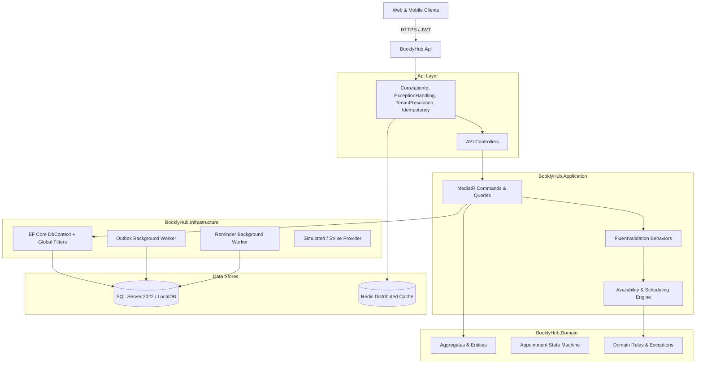

# BooklyHub — Production-Grade Multi-Tenant Booking & Appointment SaaS

[](https://dotnet.microsoft.com/)
[](https://www.microsoft.com/sql-server)
[](https://redis.io/)
[](https://github.com/BooklyHub/BooklyHub/actions/workflows/ci.yml)
[](https://opensource.org/licenses/MIT)

**BooklyHub** is an enterprise-ready, modular multi-tenant appointment and scheduling SaaS backend built in **.NET 10** using ASP.NET Core Web API, Entity Framework Core, SQL Server, Redis, and CQRS with MediatR.

It is designed to power scheduling for diverse appointment-based businesses:
- 🏥 **Medical & Dental Clinics** (multi-doctor schedules, treatment rooms, equipment reservations)
- 💇 **Beauty Salons & Barbers** (stylists, custom service durations, chair allocations)
- 🏋️ **Fitness Studios & Personal Trainers** (recurring slots, multi-location gyms)
- ⚖️ **Professional Consultants & Tutors** (buffer times, advance notice, automated reminders)

---

## 🌟 Key Architectural Highlights

- **Clean Architecture & Modular Monolith**: Strict dependency boundaries (`Domain` ➔ `Application` ➔ `Infrastructure` ➔ `Api`). Zero third-party leakages in Domain.
- **Strict Multi-Tenancy Isolation**: Tenant context extracted automatically via middleware; dynamic EF Core Global Query Filters guarantee no cross-tenant data leakage. Tested against real SQL Server with automated IDOR verification.
- **Deterministic Interval-Based Availability Engine**: Evaluates staff shifts, custom breaks, location holidays, availability exceptions, service buffers (before/after), and shared physical resources without brute-force minute-by-minute iterations.
- **Atomic Concurrency & Double-Booking Guard**: Transactional serialization combining SQL Server application locks (`sp_getapplock`) at two levels — location-wide booking plus staff calendar — with a single availability guard that both previews and books through the same rule set. Verified under simultaneous booking race conditions against real SQL Server: 5 clients on one slot, 4 staff on one treatment room, and recurring series whose resource holdings must be visible to the next booking.
- **Zero N+1 Query Guarantee**: All critical read paths (paginated appointment lists, dashboards, staff schedules) utilize projection queries and set-based SQL aggregations verified by automated query interceptors.
- **Idempotency & Webhook Replay Protection**: RFC-compliant `Idempotency-Key` middleware with distributed Redis/database caching to ensure state-modifying actions are safe against network retries.
- **Transactional Outbox & Reliable Reminders**: Domain events are persisted to `OutboxMessages` atomically with business data. Background workers process events with exponential backoff and dispatch automated appointment reminders.

---

## 🏗️ Architecture Overview



---

## 🚀 Quickstart

### Prerequisites
- [.NET 10 SDK](https://dotnet.microsoft.com/download/dotnet/10.0) (10.0.100+)
- [SQL Server 2022](https://www.microsoft.com/sql-server) or `sqllocaldb` (default on Windows)
- [Docker & Docker Compose](https://www.docker.com/) (optional, for containerized run)

### Running Locally with .NET CLI

1. **Clone the repository**:
   ```bash
   git clone https://github.com/BooklyHub/BooklyHub.git
   cd BooklyHub
   ```

2. **Restore and Build**:
   ```bash
   dotnet restore
   dotnet build
   ```

3. **Run Database Migrations & Seed Data**:
   Migration and seeding are driven by the `AutoMigrateAndSeed` setting, which is `true` in `appsettings.Development.json` and `false` everywhere else. In Development the demo data also needs `Seed:AdminEmail` and `Seed:AdminPassword`; a failed migration aborts startup instead of serving traffic on a broken schema.
   ```bash
   dotnet run --project src/BooklyHub.Api
   ```

   For any non-development run you must supply configuration explicitly — there are no fallback secrets or connection strings baked into the build:

   | Setting | Purpose |
   | :--- | :--- |
   | `ConnectionStrings__DefaultConnection` | SQL Server database |
   | `ConnectionStrings__Redis` | Distributed cache; required in Production |
   | `Jwt__Secret` | HMAC signing key, at least 32 bytes |
   | `Jwt__Issuer`, `Jwt__Audience` | Must match the tokens you mint |
   | `AutoMigrateAndSeed` | `true` migrates and seeds on startup; prefer `dotnet run --project src/BooklyHub.Api -- --migrate-only` |

4. **Access Swagger UI**:
   Open [http://localhost:5000/swagger](http://localhost:5000/swagger) in your browser.

---

### Running with Docker Compose

To spin up the entire production-like environment with SQL Server 2022, Redis, and the API:

```bash
cp .env.example .env   # then set MSSQL_SA_PASSWORD and JWT_SECRET
docker-compose up --build -d
```

The API will be available at [http://localhost:5000](http://localhost:5000). Compose refuses to start without
those variables, and SQL Server, Redis and the API port are published on `127.0.0.1` only. Schema creation and
demo seeding happen in a one-shot `migrator` container (`--migrate-only`) that must exit successfully before the
API starts; the API container itself never migrates or seeds.

---

## 🧪 Automated Testing Suite

The repository contains both Unit Tests and full Integration Tests running against real SQL Server:

```bash
# Run unit tests (23 tests: Domain rules, state machine, interval algebra, scheduling)
dotnet test tests/BooklyHub.UnitTests

# Run integration tests (6 tests: Concurrency, double-booking, tenant isolation, N+1 regression)
dotnet test tests/BooklyHub.IntegrationTests
```

### Verified Test Scenarios:
| Test Area | Description | Status |
| :--- | :--- | :--- |
| **Concurrency Guard** | 5 concurrent clients booking the exact same time slot; exactly 1 succeeds (201 Created), remaining 4 receive 409 Conflict. | ✅ PASSED |
| **N+1 Prevention** | Fetching 25 appointments executes $\le 2$ SQL queries (Count + Paginated Fetch). | ✅ PASSED |
| **Reporting Aggregation** | Multi-metric dashboard executes $\le 4$ pure SQL set-based queries without loading rows in memory. | ✅ PASSED |
| **Cross-Tenant IDOR** | Tenant B attempting to read Tenant A's appointments or customers receives 404/403. | ✅ PASSED |
| **State Machine** | Enforces valid transitions (`Pending` ➔ `Confirmed` ➔ `Completed`), rejects invalid ones (`Cancelled` ➔ `Completed`). | ✅ PASSED |

---

## 🏢 Pre-Seeded Multi-Tenant Demo Data

When launched in development mode, the database seeder creates 3 complete, realistic tenant environments:

| Tenant | Business Type | Details |
| :--- | :--- | :--- |
| **Apex Dental Clinic** | Medical / Dental | 2 Locations (Downtown, Westside), 3 Dentists/Hygienists, 6 Dental Services, 3 Treatment Rooms, 2 X-Ray Machines. |
| **Luxe Hair & Beauty Lounge** | Salon / Wellness | 1 Location, 4 Stylists & Colorists, 5 Beauty Services, 4 Styling Chairs, Upfront deposit enabled. |
| **Pulse Fitness & Performance** | Gym / Training | 1 Location, 3 Certified Personal Trainers, 4 Training Programs, 2 Private Studios, 2 Squat Racks. |

---

## 📚 Deep-Dive Technical Documentation

Explore the comprehensive architectural documentation in the `docs/` folder:

- [**System Architecture**](docs/ARCHITECTURE.md) — Modular monolith design, pipeline behaviors, and CQRS patterns.
- [**Database Schema & Strategy**](docs/DATABASE.md) — ER diagrams, composite indexes, soft deletes, and RowVersion tokens.
- [**Scheduling & Availability Engine**](docs/SCHEDULING-ENGINE.md) — Deterministic interval algebra and DST timezone conversions.
- [**Concurrency & Double-Booking Guard**](docs/SCHEDULING-CONCURRENCY.md) — SQL Server `sp_getapplock` and transaction isolation details.
- [**Multi-Tenancy Isolation**](docs/MULTI-TENANCY.md) — Dynamic query filters, tenant resolution, and data safety.
- [**Security & Permissions**](docs/SECURITY.md) — JWT auth, refresh token rotation, PBKDF2 hashing, and RBAC permissions.
- [**Performance & Query Optimization**](docs/PERFORMANCE.md) — N+1 query elimination, pagination, and caching strategies.
- [**API Reference & Contracts**](docs/API.md) — Endpoint specifications, request/response models, and error handling.
