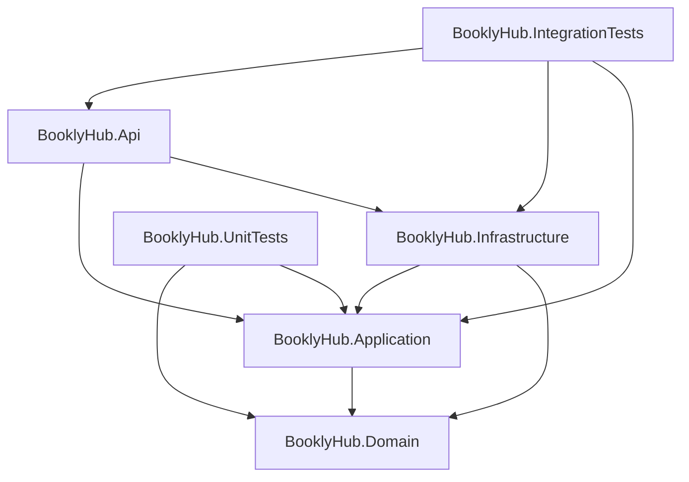
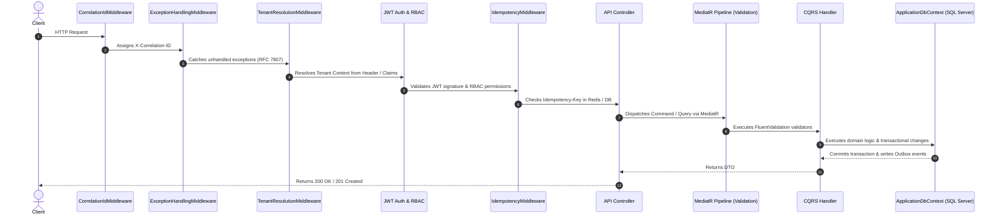

# BooklyHub — System Architecture

## 1. Architectural Philosophy

BooklyHub is architected as a **Modular Monolith** adhering to the principles of **Clean Architecture** and **Domain-Driven Design (DDD)**. 

### Why Modular Monolith?
For a SaaS booking platform, a modular monolith provides:
- **Transactional Consistency**: Booking, resource allocation, and payment authorization can execute within ACID boundaries without distributed two-phase commits.
- **Strict Code Boundaries**: Each domain capability (Tenancy, Identity, Catalog, Scheduling, Booking, Payments, Reviews) is encapsulated with clean interfaces, allowing seamless extraction into independent microservices if organizational scale demands it.
- **Operational Simplicity**: Single deployment artifact, low operational latency, and zero network serialization overhead between modules.

---

## 2. Solution Structure & Dependency Flow

### The Inversion of Control Rule:
- **`BooklyHub.Domain`**: Has **zero** external library dependencies. Contains only pure C# domain entities, aggregate roots, domain exceptions, domain events, and value objects.
- **`BooklyHub.Application`**: Defines use-cases (CQRS commands and queries), validation rules, DTOs, and interface contracts (`IApplicationDbContext`, `IAvailabilityService`, `ICurrentUser`, `ITenantContext`).
- **`BooklyHub.Infrastructure`**: Implements interfaces using EF Core SQL Server, StackExchange.Redis, PBKDF2 password hashing, and background workers.
- **`BooklyHub.Api`**: The entry point hosting ASP.NET Core Web API, middlewares, dependency injection composition, and HTTP route endpoints.

---

## 3. End-to-End Request Pipeline

Every incoming HTTP request traverses a hardened middleware pipeline before reaching the CQRS command/query handlers:

---

## 4. Key Cross-Cutting Concerns

### 4.1 RFC 7807 Problem Details
Errors are never returned as raw text or stack traces. The `ExceptionHandlingMiddleware` intercepts all domain exceptions, validation failures, and database conflicts and transforms them into standardized `ProblemDetails`:
- `ValidationException` ➔ `400 Bad Request` with field-by-field error dictionary.
- `NotFoundException` ➔ `404 Not Found`.
- `BookingConflictException` ➔ `409 Conflict`.
- `BusinessRuleValidationException` ➔ `422 Unprocessable Entity`.
- `UnauthorizedAccessException` ➔ `401 Unauthorized`.

### 4.2 Correlation & Observability
Every request receives or preserves an `X-Correlation-ID` header. This correlation ID is pushed to Serilog's `LogContext`, ensuring that all logs emitted across handlers, EF Core queries, and background processors share the same traceable ID.

### 4.3 Idempotency Middleware
All `POST` and `PUT` endpoints accept an optional or required `Idempotency-Key` header:
- In-flight requests are tracked to prevent duplicate concurrent submissions.
- Completed responses are cached with HTTP status code and response payload.
- Network re-transmissions receive the exact previous result immediately without executing redundant database writes or payment transactions.
- The key is scoped by tenant (`<tenantId:N>:<key>`, or a `global` bucket for a request with no tenant), and the stored `RequestHash` is compared on replay: the same key with a different payload is refused with `409`, not silently served the old answer.
- The record lives for `RetentionPolicy.IdempotencyWindow` (24 h), which is one constant shared with the retention sweep rather than a number written twice — the middleware mints the deadline and the sweep deletes past it, so a key cannot be replayable and collectable at the same time. Both ends are pinned by one test that stores a key through the wire and sweeps it inside and outside the window. See `SECURITY.md` §1.3.
