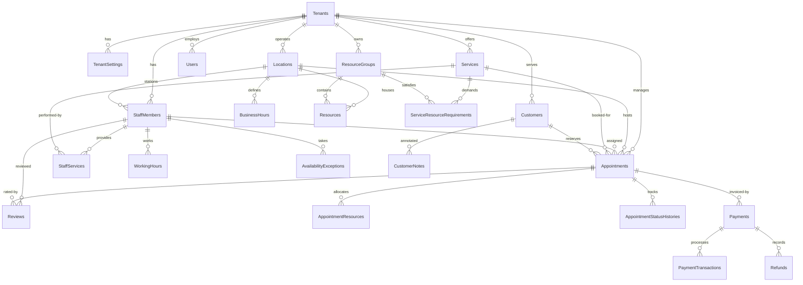

# BooklyHub — Database Architecture & Schema Design

## 1. Database Overview & Tenancy Strategy

BooklyHub uses **Microsoft SQL Server 2022** (or SQL Server LocalDB in local environments) with **Entity Framework Core 10**.

### Multi-Tenant Strategy: Shared Database, Shared Schema
We implement the **shared database, shared schema with tenant discriminator column** pattern:
- **Cost Efficiency**: High tenant density with minimal resource overhead.
- **Tenant Isolation**: Strictly enforced at the data access layer via EF Core **Global Query Filters** (`(Guid?)e.TenantId == CurrentTenantId`).
- **Composite Indexing**: Every business table includes `TenantId` as the leading column in composite indexes, enabling SQL Server to execute targeted index seeks rather than full table scans.

---

## 2. Entity Relationship Diagram (ERD)



---

## 3. High-Performance Indexing Strategy

To guarantee sub-second responses even with millions of rows across hundreds of tenants, the database schema utilizes specialized composite and filtered indexes:

### 3.1 Appointments Indexing
| Index Name | Columns | Purpose |
| :--- | :--- | :--- |
| `IX_Appointments_Tenant_Staff_TimeRange` | `(TenantId, StaffId, StartAtUtc, EndAtUtc)` | High-frequency availability overlap checks and calendar queries. |
| `IX_Appointments_Tenant_Customer_StartAt` | `(TenantId, CustomerId, StartAtUtc)` | Customer booking history and duplicate appointment detection. |
| `IX_Appointments_Tenant_Status_StartAt` | `(TenantId, Status, StartAtUtc)` | Operational dashboards, the background reminder dispatcher, and the no-show sweep. |

The no-show sweep asks for `TenantId = @t AND Status = Confirmed AND EndAtUtc BETWEEN @floor AND @deadline`,
ordered by `EndAtUtc`. It seeks on the first two columns of the index above and applies `EndAtUtc` as a
residual predicate plus a sort, which is the intended shape while a tenant's open `Confirmed` population
stays small; that population is exactly what the sweep drains every 15 minutes. If it stops draining —
because bookings go unpaid and the ledger keeps them open — the sweep needs its own
`(TenantId, Status, EndAtUtc)` index, and so does the reporting gap it exposes.

That gap is now a surface: `GET /api/v1/payments/outstanding-visits` asks for
`TenantId = @t AND Status IN (Confirmed, Completed) AND EndAtUtc <= @deadline`, owing money, ordered by
`EndAtUtc`. It is the wider of the two reads — two statuses, no upper bound on age, and one correlated
payment aggregate per candidate row — and it runs while a human pages through it rather than once every
15 minutes. Still the intended shape for a small tenant's open book; the same
`(TenantId, Status, EndAtUtc)` index is what both the sweep and the queue are waiting on.

### 3.2 Staff & Availability Indexing
| Index Name | Columns | Purpose |
| :--- | :--- | :--- |
| `IX_WorkingHours_Tenant_Staff_DayOfWeek` | `(TenantId, StaffId, DayOfWeek)` | Resolving daily shift intervals. |
| `IX_AvailabilityExceptions_Tenant_Staff_TimeRange` | `(TenantId, StaffId, StartDateTimeUtc, EndDateTimeUtc)` | Overriding holidays, vacations, and sick leaves. |

### 3.3 Transactional Outbox Filtered Index
```sql
CREATE NONCLUSTERED INDEX [IX_OutboxMessages_Processed_Retry]
ON [OutboxMessages] ([ProcessedOnUtc], [NextRetryTimeUtc])
WHERE [ProcessedOnUtc] IS NULL;
```
This **partial / filtered index** contains only unhandled outbox events. The background worker queries only the active queue without scanning millions of historically processed messages.

---

## 4. Auditing, Soft Deletes & Optimistic Concurrency

All core entities inherit from `AggregateRoot<TId>` and implement enterprise tracking interfaces:

1. **`IAuditableEntity`**: Automatically populates `CreatedAtUtc`, `CreatedBy`, `LastModifiedAtUtc`, and `LastModifiedBy` within `ApplicationDbContext.SaveChangesAsync()` using `IClock` and `ICurrentUser`.
2. **`ISoftDeletable`**: Overrides EF Core entity deletion to set `IsDeleted = true`, `DeletedAtUtc = DateTime.UtcNow`, and `DeletedBy = CurrentUser`. Soft-deleted records are automatically filtered out by query filters.
3. **`RowVersion` Concurrency Tokens**: The `Appointments` table includes a `byte[] RowVersion` column decorated with `IsRowVersion()`, preventing lost updates during simultaneous modifications. EF materialises it as a SQL Server `rowversion`, so every update to the row — including a bare `UPDATE` from another session — bumps it, and an update issued against a stale token affects 0 rows and throws `DbUpdateConcurrencyException` instead of overwriting what the other writer committed. The writer that depends on it today is the no-show sweep: it judges a batch of `Confirmed` rows and closes them in one transaction, and a staff member who checked a patient in during that window would otherwise be restated as an absence. Money writes depend on it too, in the other direction: a charge or a refund settles a booking without changing the appointment row, so both paths restamp that row's audit columns after their tracked save — that is what moves the token and makes a closure decided against the old ledger get refused and re-judged. See section 5 of [SCHEDULING-CONCURRENCY.md](./SCHEDULING-CONCURRENCY.md) for how the sweep reacts to the conflict. Removing `.IsRowVersion()` is a schema change, not a config-only one: the model then diverges from the snapshot and `Database.MigrateAsync()` fails with `PendingModelChangesWarning`.

---

## 5. Retention of Operational Rows

Four tables append and, before this section, never removed: `IdempotencyRecords`, `RefreshTokens`, `OutboxMessages`, `NotificationRecords`. The horizons and the reasoning are in `SECURITY.md` §1.3; the mechanism is `RetentionSweepBackgroundService`, which reads a page of ids and deletes exactly those ids — `ExecuteDeleteAsync` cannot carry a `TOP`, so the batching is a read plus a `WHERE Id IN (…)` rather than one bounded statement.

| Table | Age column the sweep reads | Index backing that read |
| :--- | :--- | :--- |
| `IdempotencyRecords` | `ExpiresAtUtc` | `IX_IdempotencyRecords_ExpiresAtUtc` — the index the schema already shipped for exactly this purpose. |
| `RefreshTokens` | `ExpiresAtUtc` | No index. `IX_RefreshTokens_Token` is unique on the credential and does not help an age predicate. |
| `OutboxMessages` | `OccurredOnUtc` (delivered rows only) | No index. `IX_OutboxMessages_PendingQueue` is **filtered on `ProcessedOnUtc IS NULL`**, so it covers the dispatcher's queue and deliberately does not contain the delivered rows the sweep reads. |
| `NotificationRecords` | `SentAtUtc` (sent rows only) | No index. `IX_NotificationRecords_TenantId_IsSent` leads on the tenant and does not order by age. |

Three of the four deletes therefore scan. That is stated rather than fixed here because the size at which a scan of an aged-out operational table stops being trivial is a measurement this repository does not have yet; adding three indexes to satisfy a shape rather than an observed cost would tax every insert to serve a job that runs every six hours. The batch bound (2 000 rows per statement, 50 batches per table per tick) is what keeps a first run against an unpruned backlog from becoming one long lock.
