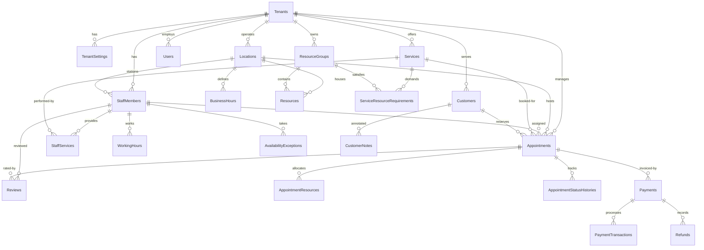

# BooklyHub — Database Architecture & Schema Design

## 1. Database Overview & Tenancy Strategy

BooklyHub uses **Microsoft SQL Server 2022** (or SQL Server LocalDB in local environments) with **Entity Framework Core 10**.

### Multi-Tenant Strategy: Shared Database, Shared Schema
We implement the **shared database, shared schema with tenant discriminator column** pattern:
- **Cost Efficiency**: High tenant density with minimal resource overhead.
- **Tenant Isolation**: Strictly enforced at the data access layer via EF Core **Global Query Filters** (`(Guid?)e.TenantId == CurrentTenantId`).
- **Composite Indexing**: Every business table includes `TenantId` as the leading column in composite indexes, enabling SQL Server to execute targeted index seeks rather than full table scans.

---

## 2. Entity Relationship Diagram (ERD)



---

## 3. High-Performance Indexing Strategy

To guarantee sub-second responses even with millions of rows across hundreds of tenants, the database schema utilizes specialized composite and filtered indexes:

### 3.1 Appointments Indexing
| Index Name | Columns | Purpose |
| :--- | :--- | :--- |
| `IX_Appointments_Tenant_Staff_TimeRange` | `(TenantId, StaffId, StartAtUtc, EndAtUtc)` | High-frequency availability overlap checks and calendar queries. |
| `IX_Appointments_Tenant_Customer_StartAt` | `(TenantId, CustomerId, StartAtUtc)` | Customer booking history and duplicate appointment detection. |
| `IX_Appointments_Tenant_Status_StartAt` | `(TenantId, Status, StartAtUtc)` | Operational dashboards and background reminder dispatchers. |

### 3.2 Staff & Availability Indexing
| Index Name | Columns | Purpose |
| :--- | :--- | :--- |
| `IX_WorkingHours_Tenant_Staff_DayOfWeek` | `(TenantId, StaffId, DayOfWeek)` | Resolving daily shift intervals. |
| `IX_AvailabilityExceptions_Tenant_Staff_TimeRange` | `(TenantId, StaffId, StartDateTimeUtc, EndDateTimeUtc)` | Overriding holidays, vacations, and sick leaves. |

### 3.3 Transactional Outbox Filtered Index
```sql
CREATE NONCLUSTERED INDEX [IX_OutboxMessages_Processed_Retry]
ON [OutboxMessages] ([ProcessedOnUtc], [NextRetryTimeUtc])
WHERE [ProcessedOnUtc] IS NULL;
```
This **partial / filtered index** contains only unhandled outbox events. The background worker queries only the active queue without scanning millions of historically processed messages.

---

## 4. Auditing, Soft Deletes & Optimistic Concurrency

All core entities inherit from `AggregateRoot<TId>` and implement enterprise tracking interfaces:

1. **`IAuditableEntity`**: Automatically populates `CreatedAtUtc`, `CreatedBy`, `LastModifiedAtUtc`, and `LastModifiedBy` within `ApplicationDbContext.SaveChangesAsync()` using `IClock` and `ICurrentUser`.
2. **`ISoftDeletable`**: Overrides EF Core entity deletion to set `IsDeleted = true`, `DeletedAtUtc = DateTime.UtcNow`, and `DeletedBy = CurrentUser`. Soft-deleted records are automatically filtered out by query filters.
3. **`RowVersion` Concurrency Tokens**: The `Appointments` table includes a `byte[] RowVersion` column decorated with `IsRowVersion()`, preventing lost updates during simultaneous modifications.
