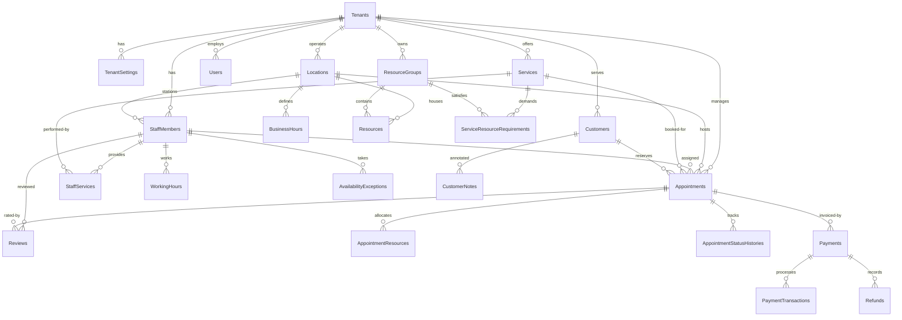

# BooklyHub — Database Architecture & Schema Design

## 1. Database Overview & Tenancy Strategy

BooklyHub uses **Microsoft SQL Server 2022** (or SQL Server LocalDB in local environments) with **Entity Framework Core 10**.

### Multi-Tenant Strategy: Shared Database, Shared Schema
We implement the **shared database, shared schema with tenant discriminator column** pattern:
- **Cost Efficiency**: High tenant density with minimal resource overhead.
- **Tenant Isolation**: Strictly enforced at the data access layer via EF Core **Global Query Filters** (`(Guid?)e.TenantId == CurrentTenantId`).
- **Composite Indexing**: Every business table includes `TenantId` as the leading column in composite indexes, enabling SQL Server to execute targeted index seeks rather than full table scans.

---

## 2. Entity Relationship Diagram (ERD)



---

## 3. High-Performance Indexing Strategy

To guarantee sub-second responses even with millions of rows across hundreds of tenants, the database schema utilizes specialized composite and filtered indexes:

### 3.1 Appointments Indexing
| Index Name | Columns | Purpose |
| :--- | :--- | :--- |
| `IX_Appointments_Tenant_Staff_TimeRange` | `(TenantId, StaffId, StartAtUtc, EndAtUtc)` | High-frequency availability overlap checks and calendar queries. |
| `IX_Appointments_Tenant_Customer_StartAt` | `(TenantId, CustomerId, StartAtUtc)` | Customer booking history and duplicate appointment detection. |
| `IX_Appointments_Tenant_Status_StartAt` | `(TenantId, Status, StartAtUtc)` | Operational dashboards, the background reminder dispatcher, and the no-show sweep. |
| `IX_Appointments_Tenant_Location_EndAt` | `(TenantId, LocationId, EndAtUtc)` INCLUDE `(StartAtUtc, StaffId, Status)` | The availability guard's occupancy read for one location over a forward window. |

The no-show sweep asks for `TenantId = @t AND Status = Confirmed AND EndAtUtc BETWEEN @floor AND @deadline`,
ordered by `EndAtUtc`. It seeks on the first two columns of the index above and applies `EndAtUtc` as a
residual predicate plus a sort, which is the intended shape while a tenant's open `Confirmed` population
stays small; that population is exactly what the sweep drains every 15 minutes. If it stops draining —
because bookings go unpaid and the ledger keeps them open — the sweep needs its own
`(TenantId, Status, EndAtUtc)` index, and so does the reporting gap it exposes.

That gap is now a surface: `GET /api/v1/payments/outstanding-visits` asks for
`TenantId = @t AND Status IN (Confirmed, Completed) AND EndAtUtc <= @deadline`, owing money, ordered by
`EndAtUtc`. It is the wider of the two reads — two statuses, no upper bound on age, and one correlated
payment aggregate per candidate row — and it runs while a human pages through it rather than once every
15 minutes. Still the intended shape for a small tenant's open book; the same
`(TenantId, Status, EndAtUtc)` index is what both the sweep and the queue are waiting on.

The availability guard reads a different thing: one location's occupancy for the window it is about to answer —
`TenantId = @t AND LocationId = @l AND Status <> Cancelled AND StartAtUtc < @to AND EndAtUtc > @from` — and until
PERF-09 nothing on the table led with `(TenantId, LocationId)`. Measured with `SET STATISTICS IO` on the guard's own
statement (60 000 rows in the table, 5 000 of them at the measured location, spread over four years, and 5 000
resource rows so the child join is not free): **363 logical reads**, whichever window was asked for — tomorrow, a
year, last week. That cost was the optimizer intersecting three indexes (`IX_Appointments_LocationId`,
`IX_Appointments_Tenant_Staff_TimeRange`, `IX_Appointments_Tenant_Status_StartAt`) because an overlap predicate
carries two range columns and a nonclustered index can seek only one. `IX_Appointments_Tenant_Location_EndAt`
replaces that with a single seek and **29 reads**, and keeps the projection in `INCLUDE` so no key lookup comes back.

`EndAtUtc` was chosen as the seekable column on a scaling argument, not on the measured gap: at this distribution
leading with `StartAtUtc` cost 35 reads for a tomorrow window and 47 for a one-year window, against 29 for
`EndAtUtc` in every window. Both beat the old shape by an order of magnitude; they differ in *what they grow with*.
Seeking `StartAtUtc < @to` must walk everything the location booked before the window closes — its whole history —
while `EndAtUtc > @from` walks the forward tail, which the tenant's own `MaxAdvanceBookingDays` bounds. Rejected by
the same measurement: the same keys without the `INCLUDE` set (348 reads — the win was coverage, not column
choice), a bare `(TenantId, LocationId, StartAtUtc)` (352), and `(TenantId, LocationId, Status, StartAtUtc)` (58 —
`<>` cannot seek, so it opens two ranges and reads the location twice). Pinned by
`OccupancyIndexTests.Occupancy_index_must_lead_with_the_location_seek_on_the_forward_bound_and_cover_the_projection`
and by `…Occupancy_read_must_reach_appointments_through_one_access_path_and_read_a_fraction_of_the_table`, which
drives the real guard and asserts its read stays under a quarter of the clustered index (26 pages of 321 at the
seeded volume; 300 without the `INCLUDE` set, 306 with no index at all).

### 3.2 Staff & Availability Indexing
| Index Name | Columns | Purpose |
| :--- | :--- | :--- |
| `IX_WorkingHours_Tenant_Staff_DayOfWeek` | `(TenantId, StaffId, DayOfWeek)` | Resolving daily shift intervals. |
| `IX_AvailabilityExceptions_Tenant_Staff_TimeRange` | `(TenantId, StaffId, StartDateTimeUtc, EndDateTimeUtc)` | Overriding holidays, vacations, and sick leaves. |

### 3.3 Transactional Outbox Filtered Index
```sql
CREATE NONCLUSTERED INDEX [IX_OutboxMessages_Processed_Retry]
ON [OutboxMessages] ([ProcessedOnUtc], [NextRetryTimeUtc])
WHERE [ProcessedOnUtc] IS NULL;
```
This **partial / filtered index** contains only unhandled outbox events. The background worker queries only the active queue without scanning millions of historically processed messages.

### 3.4 String Collation: One Default, and the Places It Is Not the Right Answer
Nothing in the model, the migrations or the connection string declares a collation, so **every** character column inherits the database default — measured at runtime (`SERVERPROPERTY`, `DATABASEPROPERTYEX`) as `SQL_Latin1_General_CP1_CI_AS`, and confirmed per column in `sys.columns`: `RefreshTokens.Token`, `RefreshTokens.ReplacedByToken`, `IdempotencyRecords.Id`, `IdempotencyRecords.RequestHash`, `Users.Email`, `Appointments.IdempotencyKey`, `Payments.IdempotencyKey`, `Permissions.Id`, the `Email` columns on `Customers`/`Locations`/`StaffMembers`. `uniqueidentifier` keys carry none, which is why case-folding has never touched an `Id` that is a GUID.

That default is right for most of the schema and wrong in two specific places, so the rule is per-column rather than a sweep:

| Column | What it holds | Case-folding there is |
| :--- | :--- | :--- |
| `Users.Email` | A sign-in address a human types | **Desired.** The login box and the `(TenantId, Email)` unique index both promise an address is matched without regard to case. Do not "unify" it with the rows below. |
| `RefreshTokens.Token`, `ReplacedByToken` | An opaque credential, or its digest | **Wrong.** Two values differing only by case are the *same* value to `=`, and the unique index refuses them as one row (measured: `Cannot insert duplicate key row in object 'dbo.RefreshTokens' with unique index 'IX_RefreshTokens_Token'`). The identity of a credential is the string that was issued, byte for byte — enforced in code (`KEY-01`, `docs/SECURITY.md` §1.2) rather than by an `ALTER COLUMN` plus an index rebuild, because after that guard no authorization decision reads case, and a collation change would not have touched trailing space either. |
| `IdempotencyRecords.Id` | A SHA-256 digest of `{tenant}:{client key}`, lowercase hex | **Was wrong, now closed (`KEY-02`).** A client-chosen identifier whose case the client controls, and it is a **primary key**, so folding was not one loose comparison but the whole replay promise. Measured on the wire before the fix: `Idempotency-Key: KEY-02-PROBE` then `key-02-probe` with a different body → `201 Created`, then `409 Conflict {"detail":"This Idempotency-Key was already used for a different request."}` — a second, legitimate request was refused by a key it had never sent. The column is `nvarchar(256)`, so the digest fits it as-is and no migration is needed; the middleware's cache key is derived from the same function, which is the first time the cache path (ordinal) and the SQL path (case-insensitive) agreed. |
| `Appointments.IdempotencyKey`, `Payments.IdempotencyKey` | The client key, kept verbatim on the row it bought | **Wrong for the equality, right for the column.** Both are non-unique indexes, and the verbatim string is what makes a row auditable against a client's own logs, so the fix here is the comparison, not the storage: the handlers still read the candidate set by SQL (`KEY-02`) and then confirm `IdempotencyIdentity.SameKey` byte for byte in C#. Measured before that guard: a key sent with flipped case reached the booking handler's "this key already booked something" read, matched the first booking, and answered `422 {"rule":"IdempotencyKeyReused"}` — and on the payment door the flipped charge inherited the *other* amount's receipt (`200` with `"amount":40.00` for a `70.00` request). A row written before the digest existed is still answered by the retry that wrote it, because the verbatim key round-trips. |

Note that trailing space is folded by `=` for character types whatever the collation is (`SELECT CASE WHEN N'AbC' = N'AbC   ' THEN 1 END` is `1` on this database), so a case-sensitive collation alone would not have made any of these comparisons byte-exact. `IdempotencyMiddleware` `Trim()`s the header, which is why a padded key was never a third live case on the wire — but the replay store's identity no longer depends on that: a digest is over exact bytes, so `"KEY"` and `"KEY "` are two different rows there even if a client ever stopped trimming. `SameKey` is ordinal for the same reason.

---

## 4. Auditing, Soft Deletes & Optimistic Concurrency

All core entities inherit from `AggregateRoot<TId>` and implement enterprise tracking interfaces:

1. **`IAuditableEntity`**: Automatically populates `CreatedAtUtc`, `CreatedBy`, `LastModifiedAtUtc`, and `LastModifiedBy` within `ApplicationDbContext.SaveChangesAsync()` using `IClock` and `ICurrentUser`.
2. **`ISoftDeletable`**: Overrides EF Core entity deletion to set `IsDeleted = true`, `DeletedAtUtc = DateTime.UtcNow`, and `DeletedBy = CurrentUser`. Soft-deleted records are automatically filtered out by query filters.
3. **`RowVersion` Concurrency Tokens**: The `Appointments` table includes a `byte[] RowVersion` column decorated with `IsRowVersion()`, preventing lost updates during simultaneous modifications. EF materialises it as a SQL Server `rowversion`, so every update to the row — including a bare `UPDATE` from another session — bumps it, and an update issued against a stale token affects 0 rows and throws `DbUpdateConcurrencyException` instead of overwriting what the other writer committed. The writer that depends on it today is the no-show sweep: it judges a batch of `Confirmed` rows and closes them in one transaction, and a staff member who checked a patient in during that window would otherwise be restated as an absence. Money writes depend on it too, in the other direction: a charge or a refund settles a booking without changing the appointment row, so both paths restamp that row's audit columns after their tracked save — that is what moves the token and makes a closure decided against the old ledger get refused and re-judged. See section 5 of [SCHEDULING-CONCURRENCY.md](./SCHEDULING-CONCURRENCY.md) for how the sweep reacts to the conflict. Removing `.IsRowVersion()` is a schema change, not a config-only one: the model then diverges from the snapshot and `Database.MigrateAsync()` fails with `PendingModelChangesWarning`.

---

## 5. Retention of Operational Rows

Four tables append and, before this section, never removed: `IdempotencyRecords`, `RefreshTokens`, `OutboxMessages`, `NotificationRecords`. The horizons and the reasoning are in `SECURITY.md` §1.3; the mechanism is `RetentionSweepBackgroundService`, which reads a page of ids and deletes exactly those ids — `ExecuteDeleteAsync` cannot carry a `TOP`, so the batching is a read plus a `WHERE Id IN (…)` rather than one bounded statement.

| Table | Age column the sweep reads | Index backing that read |
| :--- | :--- | :--- |
| `IdempotencyRecords` | `ExpiresAtUtc` | `IX_IdempotencyRecords_ExpiresAtUtc` — the index the schema already shipped for exactly this purpose. |
| `RefreshTokens` | `ExpiresAtUtc` | No index. `IX_RefreshTokens_Token` is unique on the credential and does not help an age predicate. |
| `OutboxMessages` | `OccurredOnUtc` (delivered rows only) | No index. `IX_OutboxMessages_PendingQueue` is **filtered on `ProcessedOnUtc IS NULL`**, so it covers the dispatcher's queue and deliberately does not contain the delivered rows the sweep reads. |
| `NotificationRecords` | `SentAtUtc` (sent rows only) | No index. `IX_NotificationRecords_TenantId_IsSent` leads on the tenant and does not order by age. |

Three of the four deletes therefore scan. That is stated rather than fixed here because the size at which a scan of an aged-out operational table stops being trivial is a measurement this repository does not have yet; adding three indexes to satisfy a shape rather than an observed cost would tax every insert to serve a job that runs every six hours. The batch bound (2 000 rows per statement, 50 batches per table per tick) is what keeps a first run against an unpruned backlog from becoming one long lock.
