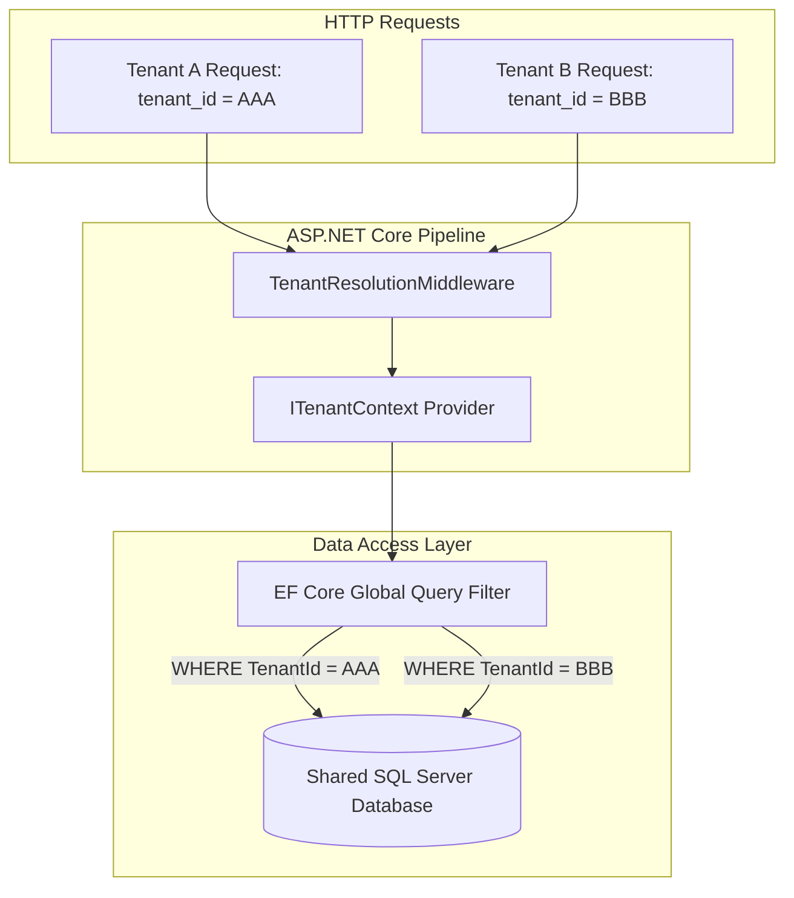

# BooklyHub — Multi-Tenancy & Data Isolation

## 1. Isolation Model

BooklyHub utilizes a **Shared Database, Shared Schema** multi-tenancy model with a strict logical tenant boundary enforced at the database abstraction layer:



---

## 2. Tenant Context Resolution (`TenantResolutionMiddleware`)

The `TenantResolutionMiddleware` runs at the front of the HTTP pipeline and establishes the active `ITenantContext`:

1. **Authenticated Users**: The middleware inspects the JWT claims for `tenant_id`. For authenticated staff or customers, the JWT claim is the **cryptographic source of truth** and cannot be spoofed by custom request headers.
2. **Public / Anonymous Endpoints**: For public endpoints (e.g. guest booking portals or availability checks), the tenant is resolved via the `X-Tenant-ID` request header or subdomain routing.
3. **Tenant Existence & Status Check**: The middleware confirms that the resolved `TenantId` exists in the database and `IsActive == true`. If invalid or inactive, the request is rejected with `400 Bad Request` or `403 Forbidden`.

---

## 3. Dynamic EF Core Global Query Filters

All entities implementing `ITenantEntity` (`Appointments`, `Customers`, `Staff`, `Services`, `Payments`, etc.) have their database queries automatically parameterized:

```csharp
// Dynamic filter generated in ApplicationDbContext.OnModelCreating:
(Guid?)e.TenantId == CurrentTenantId || IsPlatformAdmin
```

### Key Technical Safeguards:
- **Null Safety**: The filter is built with `Expression.Convert(tenantIdProp, typeof(Guid?)) == currentTenantIdProp`, preventing runtime `InvalidOperationException: Nullable object must have a value` when filtering.
- **SQL Parameterization**: EF Core parameterizes `CurrentTenantId` as `@__CurrentTenantId_0` in SQL Server, ensuring optimal query plan caching and query reuse.
- **Platform Admin Bypass**: Platform administrators (`IsPlatformAdmin == true`) can query across tenants for maintenance, invoicing, and support.

---

## 4. Elimination of Cross-Tenant IDOR (Insecure Direct Object References)

In traditional web applications, querying an entity by its primary key (e.g. `GET /api/v1/customers/{id}`) often causes security leaks if the developer forgets to append `AND TenantId = currentTenant`.

In BooklyHub:
- Even if an attacker in Tenant B guesses or extracts a valid `CustomerId` belonging to Tenant A, the Global Query Filter automatically injects `WHERE TenantId = 'Tenant-B-Guid'`.
- SQL Server returns 0 matching rows.
- The API handler triggers a `NotFoundException` (HTTP 404), completely concealing Tenant A's data.
- This behavior is continuously verified in `tests/BooklyHub.IntegrationTests/Security/CrossTenantSecurityTests.cs`.
