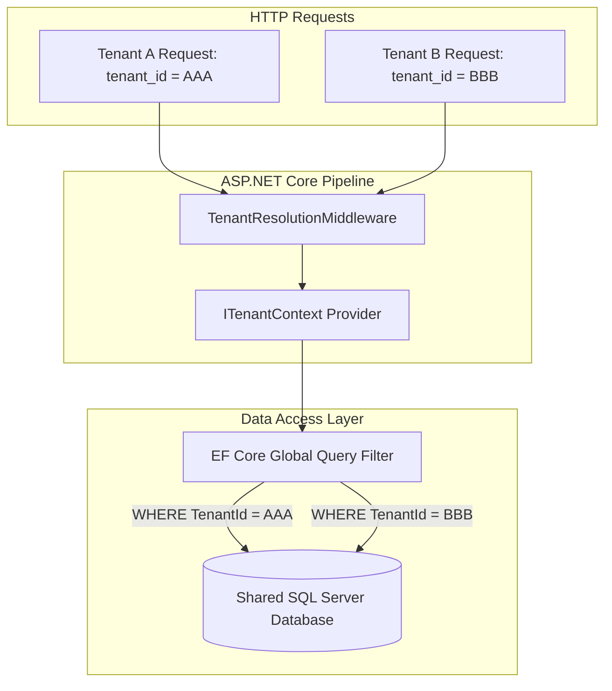

# BooklyHub — Multi-Tenancy & Data Isolation

## 1. Isolation Model

BooklyHub utilizes a **Shared Database, Shared Schema** multi-tenancy model with a strict logical tenant boundary enforced at the database abstraction layer:



---

## 2. Tenant Context Resolution (`TenantResolutionMiddleware`)

The `TenantResolutionMiddleware` runs at the front of the HTTP pipeline and establishes the active `ITenantContext`:

1. **Authenticated Users**: The middleware inspects the JWT claims for `tenant_id`. For authenticated staff or customers, the JWT claim is the **cryptographic source of truth** and cannot be spoofed by custom request headers.
2. **Public / Anonymous Endpoints**: For public endpoints (e.g. guest booking portals or availability checks), the tenant is resolved via the `X-Tenant-ID` request header or subdomain routing.
3. **Tenant Existence & Status Check**: The middleware confirms that the resolved `TenantId` exists in the database and `IsActive == true`. If invalid or inactive, the request is rejected with `400 Bad Request` or `403 Forbidden`.

---

## 3. Dynamic EF Core Global Query Filters

All entities implementing `ITenantEntity` (`Appointments`, `Customers`, `Staff`, `Services`, `Payments`, etc.) have their database queries automatically parameterized:

```csharp
// Dynamic filter generated in ApplicationDbContext.OnModelCreating:
(Guid?)e.TenantId == CurrentTenantId || IsPlatformAdmin
```

### Key Technical Safeguards:
- **Null Safety**: The filter is built with `Expression.Convert(tenantIdProp, typeof(Guid?)) == currentTenantIdProp`, preventing runtime `InvalidOperationException: Nullable object must have a value` when filtering.
- **SQL Parameterization**: EF Core parameterizes `CurrentTenantId` as `@__CurrentTenantId_0` in SQL Server, ensuring optimal query plan caching and query reuse.
- **Platform Admin Bypass**: Platform administrators (`IsPlatformAdmin == true`) can query across tenants for maintenance, invoicing, and support.

---

## 4. Elimination of Cross-Tenant IDOR (Insecure Direct Object References)

In traditional web applications, querying an entity by its primary key (e.g. `GET /api/v1/customers/{id}`) often causes security leaks if the developer forgets to append `AND TenantId = currentTenant`.

In BooklyHub:
- Even if an attacker in Tenant B guesses or extracts a valid `CustomerId` belonging to Tenant A, the Global Query Filter automatically injects `WHERE TenantId = 'Tenant-B-Guid'`.
- SQL Server returns 0 matching rows.
- The API handler triggers a `NotFoundException` (HTTP 404), completely concealing Tenant A's data.
- This behavior is continuously verified in `tests/BooklyHub.IntegrationTests/Security/CrossTenantSecurityTests.cs`.

---

## 5. Write-Path Enforcement and Host Workers

The global query filter only constrains reads, so two further rules close the loop:

**Cross-tenant write invariant (`ApplicationDbContext.SaveChangesAsync`).**
Any `Added`, `Modified` or `Deleted` entity whose `TenantId` differs from the bound tenant throws
`CrossTenantAccessViolationException` (HTTP 403). It applies only when a tenant is bound and the caller is
not a platform administrator, so request handlers get a second net behind their own validation while
seeding and host work still operate across tenants.

**System scope for background workers (`SystemTenantScope.CreateSystemScope`).**
Workers resolve `IServiceScopeFactory.CreateScope()`, which carries an **unbound** `ITenantContext`:
`TenantId == null` and `IsPlatformAdmin == false`, so the filter matches nothing and a sweep would silently
process zero rows. All three host workers — `OutboxProcessorBackgroundService`,
`AppointmentReminderBackgroundService` and `AppointmentNoShowBackgroundService` — therefore open a system
scope, which binds `SetTenant(Guid.Empty, isPlatformAdmin: true)` for that scope only.

Because that scope is platform-admin, the cross-tenant write invariant above is not what limits it: the
no-show sweep is the worker that writes *appointment* rows, and it scopes itself with an explicit
`a.TenantId == tenantId` predicate per tenant, under a per-tenant `sp_getapplock`. The reminder sweep writes
notification rows only, one per booking, and scopes them the same way — by predicate, not by lock.

- `IgnoreQueryFilters()` was rejected as the fix: it also drops the `!IsDeleted` soft-delete filter and has to be remembered per query.
- Binding the scope to one tenant was rejected too: `OutboxMessage` carries no `TenantId`, and the reminder sweep is cross-tenant by design.
- Request-path code must never call `CreateSystemScope()`; the middleware owns tenant binding for HTTP calls.

**A cross-tenant read is not a cross-tenant policy.** The reminder sweep serves every tenant in one tick, but
it does not do it with one query. It reads the active tenant list once, resolves each tenant's own
`ReminderNoticeHours` (left join, `TenantSetting.DefaultReminderNoticeHours` as the fallback, because a tenant
with no settings row is still a tenant with appointments — an inner join reads as a healthy sweep for every
tenant that has a row and silently un-reminds the ones that do not), then runs **one bounded pass per tenant**,
each judged against that tenant's own window. Hardcoding one window for the platform was the original shape and
was wrong in both directions at once: a two-hour clinic was reminded a day early — and, because a reminder sends
at most once per appointment, was therefore never reminded at the hour it asked for — while a forty-eight-hour
clinic was never reached before its visit.

Because the pass runs on a platform-admin scope, the per-tenant `a.TenantId == tenant.TenantId` predicate on
that read is the only thing separating one clinic's bookings from another's, and it is load-bearing in a way an
equal-window test cannot see: with both tenants asking for the same notice, a read that dropped the predicate
still reaches the same conclusions. The binding test therefore gives the two tenants *unequal* windows.

**The execution shape, and what it costs.** Each tenant's pass takes at most `BatchSize = 200` bookings,
nearest start first, and the already-sent question is a `NOT EXISTS` inside that read rather than a filter
applied to its results — the cap has to be taken over bookings that still need a reminder, because a page
capped first and deduplicated afterwards is a page whose spent rows never leave, and a busy clinic would
re-read its own reminded head every tick and never reach the bookings behind it. Each reminder is recorded in
its own save as it leaves, and a save that fails ends that tenant's pass instead of continuing: the row is
then both sent and unrecorded, and every booking behind it would be the same. At-least-once is the deliberate
direction — a duplicate reminder is the cheaper mistake against a mail storm, which is what a single
end-of-tick save becomes when it fails after the emails have left. A *send* that fails records nothing, so the
next tick retries it; `NotificationRecord.Error` is unused here precisely because a row with a reminder subject
is a row the dedupe treats as spent, and recording a refusal would suppress the retry.

There is **no cross-instance claim** on this pass, unlike the no-show sweep: `sp_getapplock` in
`LockOwner='Transaction'` cannot span the SMTP calls a reminder pass makes, and a session-scoped lock would
need a lock lifecycle `ApplicationDbContext` does not have. Two concurrent instances would therefore both
send. `docker-compose.yml` runs one API container with no `replicas:`, so this is not reachable in the
deployment as documented; it is recorded as open rather than fixed, and named below.

Verified by `tests/BooklyHub.IntegrationTests/Notifications/ReminderNoticeHoursTests.cs` (window direction and
the missing settings row) and `tests/BooklyHub.IntegrationTests/Notifications/ReminderSweepExecutionTests.cs`
(ceiling, drain past a spent head, record-before-next-send, send failure leaves no record, one notification
read per tenant pass, inactive tenants, and the unequal-window cross-tenant binding).

Verified by `tests/BooklyHub.IntegrationTests/Notifications/NotificationDeliveryTests.cs`, which fails when
either worker is switched back to a plain scope (zero rows read, and the outbox message is marked processed
without any email being sent).
