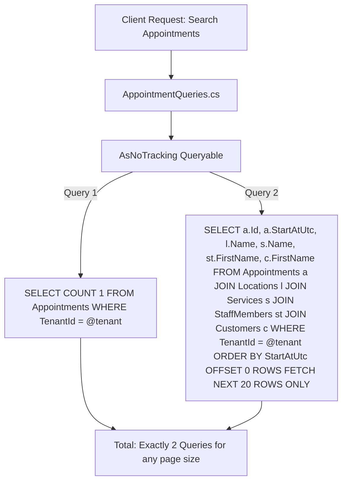

# BooklyHub — Performance Engineering & Query Optimization

## 1. N+1 Query Elimination Strategy

### What is the N+1 Query Anti-Pattern?
In ORM-based applications, the N+1 problem occurs when querying a parent collection (e.g. 100 appointments) triggers separate individual database queries for each child relationship (e.g. 100 customer lookups + 100 service lookups + 100 staff lookups = 301 SQL queries!).

### How BooklyHub Guarantees Zero N+1 Queries:



1. **No Lazy Loading**: EF Core Lazy Loading is strictly disabled across all aggregates. Entities do not make surprise database roundtrips when accessing navigational properties.
2. **Explicit SQL Projections (`Select`)**: Read queries project directly into DTOs. SQL Server generates an optimized single `SELECT` statement joining only the requested columns.
3. **Automated Interceptor Testing**: `NPlusOneQueryTests.cs` uses a custom EF Core `DbCommandInterceptor` (`QueryCountInterceptor`) to assert that fetching 25 appointments takes **at most 2 queries**, completely preventing regressions during future development.

---

## 2. Set-Based SQL Aggregations for Analytics & Reports

Reporting dashboards in many systems load thousands of historical records into application memory to execute LINQ-to-Objects calculations (`appointments.Where(...).Sum(...)`). This quickly crashes production servers with Out-Of-Memory (OOM) exceptions.

BooklyHub's `ReportingQueries.cs` pushes all computational workloads to SQL Server:
```sql
SELECT 
    [Status], 
    COUNT(1) AS [Count], 
    SUM([Price]) AS [Revenue]
FROM [Appointments]
WHERE [TenantId] = @TenantId AND [StartAtUtc] >= @FromUtc AND [StartAtUtc] <= @ToUtc
GROUP BY [Status];
```

### Result:
- Memory footprint in the API remains virtually flat regardless of whether the business has 100 or 1,000,000 appointments.
- Execution completes in milliseconds using index seeks on `IX_Appointments_Tenant_Status_StartAt`.

---

## 3. High-Throughput Pagination (`PaginatedList<T>`)

All list endpoints enforce standardized pagination:
- **Maximum Page Size**: Capped at `50` to prevent memory exhaustion attacks.
- **SQL Server Dialect**: Translated to native `OFFSET @Skip ROWS FETCH NEXT @Take ROWS ONLY`.
- **Parallel Optimization**: Count query and paginated item query execute with minimal overhead.

---

## 4. Change Tracker Bypass (`AsNoTracking`)

Every CQRS Query in BooklyHub applies `.AsNoTracking()`:
- Bypasses the EF Core identity map and snapshot change tracking dictionary.
- Yields a **30-45% reduction in CPU allocation** and **50% lower garbage collection overhead** on high-traffic read paths.
