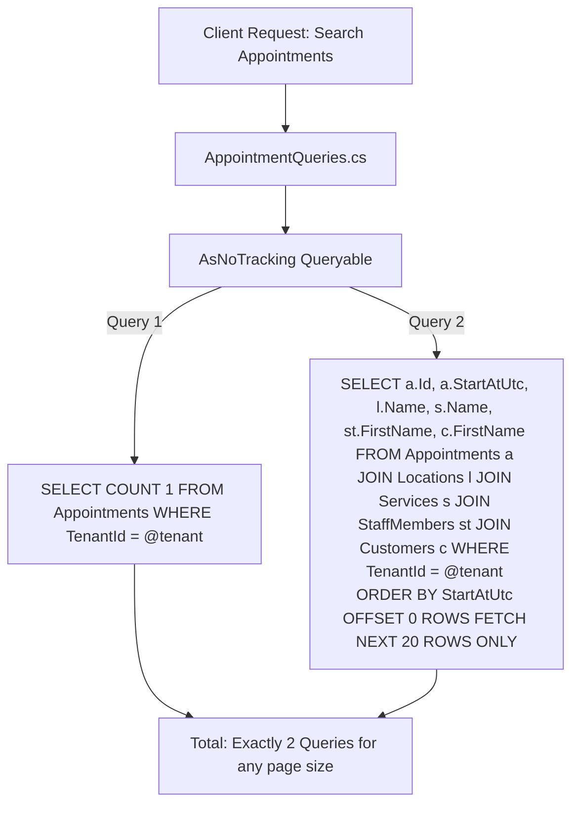

# BooklyHub — Performance Engineering & Query Optimization

## 1. N+1 Query Elimination Strategy

### What is the N+1 Query Anti-Pattern?
In ORM-based applications, the N+1 problem occurs when querying a parent collection (e.g. 100 appointments) triggers separate individual database queries for each child relationship (e.g. 100 customer lookups + 100 service lookups + 100 staff lookups = 301 SQL queries!).

### How BooklyHub Guarantees Zero N+1 Queries:



1. **No Lazy Loading**: EF Core Lazy Loading is strictly disabled across all aggregates. Entities do not make surprise database roundtrips when accessing navigational properties.
2. **Explicit SQL Projections (`Select`)**: Read queries project directly into DTOs. SQL Server generates an optimized single `SELECT` statement joining only the requested columns.
3. **Automated Interceptor Testing**: `NPlusOneQueryTests.cs` uses a custom EF Core `DbCommandInterceptor` (`QueryCountInterceptor`) to assert that fetching 25 appointments takes **at most 2 queries**, completely preventing regressions during future development.
4. **A Page Of Debt Is Three Statements**: `GET /api/v1/payments/outstanding-visits` decides who owes money in SQL (`PaymentLedgerQuery.WhereOwing`, so the queue never loads the whole overdue book to show a dozen rows), reads the page, then reads the payments for **that page in one statement** and recomputes each balance through `PaymentLedger`. `OutstandingVisitQueueTests.TheQueue_MustStayThreeStatementsAndScopeEveryOneOfThem` pins the ceiling at 3 and requires every statement to carry a tenant condition — the fourth statement would mean the ledger is being rebuilt booking by booking.

---

## 2. Set-Based SQL Aggregations for Analytics & Reports

Reporting dashboards in many systems load thousands of historical records into application memory to execute LINQ-to-Objects calculations (`appointments.Where(...).Sum(...)`). This quickly crashes production servers with Out-Of-Memory (OOM) exceptions.

BooklyHub's `ReportingQueries.cs` pushes all computational workloads to SQL Server:
```sql
SELECT 
    [Status], 
    COUNT(1) AS [Count], 
    SUM([Price]) AS [Revenue]
FROM [Appointments]
WHERE [TenantId] = @TenantId AND [StartAtUtc] >= @FromUtc AND [StartAtUtc] <= @ToUtc
GROUP BY [Status];
```

### Result:
- Memory footprint in the API remains virtually flat regardless of whether the business has 100 or 1,000,000 appointments.
- Execution completes in milliseconds using index seeks on `IX_Appointments_Tenant_Status_StartAt`.

---

## 3. Pagination (`Paging` and `PaginatedList<T>`)

Measured at `c67480f`, because this section previously claimed "all list endpoints enforce standardized pagination"
with a page size "capped at `50`", and neither was true:

- **Four routes are paged, and all four go through one rule.** `GET /api/v1/customers`, `GET /api/v1/reviews`,
  `GET /api/v1/appointments` and `GET /api/v1/payments/outstanding-visits` normalize through
  `Paging.NormalizePage` / `NormalizePageSize` / `Offset`. The ceiling is **100** with a default of **20**, not 50
  (`Paging.cs:5-6`), and an out-of-range ask falls back to the default rather than to the ceiling.
- **Two list routes are not paged at all.** The anonymous catalog reads answer a bare array with no `page`,
  `pageSize` or `Take` (`CatalogControllers.cs:27-55`, `:72-109`), so their size is bounded only by how many rows a
  tenant has. That is `PERF-04`'s open residue, not a clamp waiting for a different number.
- **The offset is computed before it is handed to SQL.** `(page - 1) * pageSize` in `int` wraps negative for a large
  `page` and reaches the server as `OFFSET -40`, which faults; `Paging.Offset` multiplies in `long` and saturates at
  `int.MaxValue` instead (`PAG-01`).
- **Two envelopes coexist.** `PaginatedList<T>` carries `items, pageNumber, pageSize, totalCount, totalPages,
  hasNextPage, hasPreviousPage`; the flat shape carries `total, page, pageSize, items`. A client reading the applied
  page has to try `pageNumber` then `page`.
- **Translation and overhead.** Both envelopes still land on native `OFFSET @Skip ROWS FETCH NEXT @Take ROWS ONLY`,
  and the count query and the item query run as two separate round trips.

---

## 4. Change Tracker Bypass (`AsNoTracking`)

Every CQRS Query in BooklyHub applies `.AsNoTracking()`:
- Bypasses the EF Core identity map and snapshot change tracking dictionary.
- Yields a **30-45% reduction in CPU allocation** and **50% lower garbage collection overhead** on high-traffic read paths.

---

## 5. Index Changes Are Measured, Not Proposed

A new index taxes every insert on the table, so `PERF-09` set the bar before adding one: **at most one index per
read, and only if it removes a sort, a key lookup, or at least half the logical reads.** Anything else is written
down and left alone.

How to reproduce the measurement, on the throwaway path only:

1. Seed volume through the fixture's own private database (`BooklyHubWebApplicationFactory` creates one per test
   class, so a heavy probe never touches the developer database), then `UPDATE STATISTICS … WITH FULLSCAN` — the
   optimizer's choices are only as good as the histogram it reads.
2. Bind a tenant before calling the service (`ITenantContext.SetTenant`). With no tenant bound the global query
   filter returns zero rows and the guard short-circuits before the read being measured.
3. Capture the statement the code actually sends — `_factory.QueryInterceptor.ExecutedCommands` — instead of
   handwriting an equivalent. Then replay that text with `SET STATISTICS IO, XML ON` and one candidate index at a
   time, and read the per-table `logical reads` from the connection's `InfoMessage` channel after the reader closes.
4. Two things on that channel are not what they look like: `SET STATISTICS XML` yields the *estimated* plan, so
   operator costs are estimates and only the read counts are actual; and `sys.dm_exec_query_stats` returned no row
   for a replayed batch even with `VIEW SERVER STATE` granted, so plan-cache totals are not a usable second source
   here.
5. Do not trust a cost that a single window shape produced. The `Appointments` overlap read asks for two range
   columns (`StartAtUtc < @to`, `EndAtUtc > @from`) and a nonclustered index can seek one; the column that leads
   decides whether the read grows with the location's history or with the tenant's booking horizon. Estimates are
   nearly identical for both — `SET STATISTICS IO` across four window shapes is what separates them.

The `Appointments` result is in `DATABASE.md` §3.1. What remains open in the same family, deliberately unindexed
because no volume was measured behind it: the appointment list's default page (`API.md`), the no-show sweep and the
outstanding-visits queue (`DATABASE.md` §3.1), and the three aged-row deletes in the retention sweep (§5).
