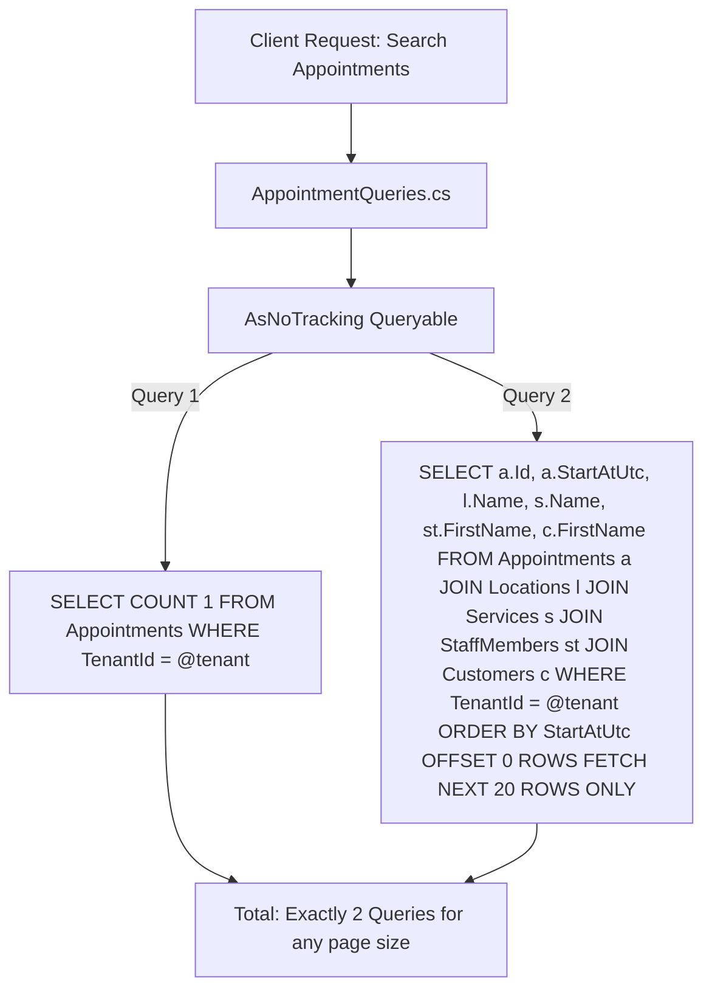

# BooklyHub — Performance Engineering & Query Optimization

## 1. N+1 Query Elimination Strategy

### What is the N+1 Query Anti-Pattern?
In ORM-based applications, the N+1 problem occurs when querying a parent collection (e.g. 100 appointments) triggers separate individual database queries for each child relationship (e.g. 100 customer lookups + 100 service lookups + 100 staff lookups = 301 SQL queries!).

### How BooklyHub Guarantees Zero N+1 Queries:



1. **No Lazy Loading**: EF Core Lazy Loading is strictly disabled across all aggregates. Entities do not make surprise database roundtrips when accessing navigational properties.
2. **Explicit SQL Projections (`Select`)**: Read queries project directly into DTOs. SQL Server generates an optimized single `SELECT` statement joining only the requested columns.
3. **Automated Interceptor Testing**: `NPlusOneQueryTests.cs` uses a custom EF Core `DbCommandInterceptor` (`QueryCountInterceptor`) to assert that fetching 25 appointments takes **at most 2 queries**, completely preventing regressions during future development.
4. **A Page Of Debt Is Three Statements**: `GET /api/v1/payments/outstanding-visits` decides who owes money in SQL (`PaymentLedgerQuery.WhereOwing`, so the queue never loads the whole overdue book to show a dozen rows), reads the page, then reads the payments for **that page in one statement** and recomputes each balance through `PaymentLedger`. `OutstandingVisitQueueTests.TheQueue_MustStayThreeStatementsAndScopeEveryOneOfThem` pins the ceiling at 3 and requires every statement to carry a tenant condition — the fourth statement would mean the ledger is being rebuilt booking by booking.

---

## 2. Set-Based SQL Aggregations for Analytics & Reports

Reporting dashboards in many systems load thousands of historical records into application memory to execute LINQ-to-Objects calculations (`appointments.Where(...).Sum(...)`). This quickly crashes production servers with Out-Of-Memory (OOM) exceptions.

BooklyHub's `ReportingQueries.cs` pushes all computational workloads to SQL Server:
```sql
SELECT 
    [Status], 
    COUNT(1) AS [Count], 
    SUM([Price]) AS [Revenue]
FROM [Appointments]
WHERE [TenantId] = @TenantId AND [StartAtUtc] >= @FromUtc AND [StartAtUtc] <= @ToUtc
GROUP BY [Status];
```

### Result:
- Memory footprint in the API remains virtually flat regardless of whether the business has 100 or 1,000,000 appointments.
- Execution completes in milliseconds using index seeks on `IX_Appointments_Tenant_Status_StartAt`.

---

## 3. Pagination (`Paging` and `PaginatedList<T>`)

Measured at `c67480f`, because this section previously claimed "all list endpoints enforce standardized pagination"
with a page size "capped at `50`", and neither was true:

- **Four routes are paged, and all four go through one rule.** `GET /api/v1/customers`, `GET /api/v1/reviews`,
  `GET /api/v1/appointments` and `GET /api/v1/payments/outstanding-visits` normalize through
  `Paging.NormalizePage` / `NormalizePageSize` / `Offset`. The ceiling is **100** with a default of **20**, not 50
  (`Paging.cs:5-6`), and an out-of-range ask falls back to the default rather than to the ceiling.
- **Two list routes are not paged at all.** The anonymous catalog reads answer a bare array with no `page`,
  `pageSize` or `Take` (`CatalogControllers.cs:27-55`, `:72-109`), so their size is bounded only by how many rows a
  tenant has. That is `PERF-04`'s open residue, not a clamp waiting for a different number.
- **The offset is computed before it is handed to SQL.** `(page - 1) * pageSize` in `int` wraps negative for a large
  `page` and reaches the server as `OFFSET -40`, which faults; `Paging.Offset` multiplies in `long` and saturates at
  `int.MaxValue` instead (`PAG-01`).
- **Two envelopes coexist.** `PaginatedList<T>` carries `items, pageNumber, pageSize, totalCount, totalPages,
  hasNextPage, hasPreviousPage`; the flat shape carries `total, page, pageSize, items`. A client reading the applied
  page has to try `pageNumber` then `page`.
- **Translation and overhead.** Both envelopes still land on native `OFFSET @Skip ROWS FETCH NEXT @Take ROWS ONLY`,
  and the count query and the item query run as two separate round trips.

---

## 4. Change Tracker Bypass (`AsNoTracking`)

Every CQRS Query in BooklyHub applies `.AsNoTracking()`:
- Bypasses the EF Core identity map and snapshot change tracking dictionary.
- Yields a **30-45% reduction in CPU allocation** and **50% lower garbage collection overhead** on high-traffic read paths.

---

## 5. Index Changes Are Measured, Not Proposed

A new index taxes every insert on the table, so `PERF-09` set the bar before adding one: **at most one index per
read, and only if it removes a sort, a key lookup, or at least half the logical reads.** Anything else is written
down and left alone.

How to reproduce the measurement, on the throwaway path only:

1. Seed volume through the fixture's own private database (`BooklyHubWebApplicationFactory` creates one per test
   class, so a heavy probe never touches the developer database), then `UPDATE STATISTICS … WITH FULLSCAN` — the
   optimizer's choices are only as good as the histogram it reads.
2. Bind a tenant before calling the service (`ITenantContext.SetTenant`). With no tenant bound the global query
   filter returns zero rows and the guard short-circuits before the read being measured.
3. Capture the statement the code actually sends — `_factory.QueryInterceptor.ExecutedCommands` — instead of
   handwriting an equivalent. Then replay that text with `SET STATISTICS IO, XML ON` and one candidate index at a
   time, and read the per-table `logical reads` from the connection's `InfoMessage` channel after the reader closes.
4. Two things on that channel are not what they look like: `SET STATISTICS XML` yields the *estimated* plan, so
   operator costs are estimates and only the read counts are actual; and `sys.dm_exec_query_stats` returned no row
   for a replayed batch even with `VIEW SERVER STATE` granted, so plan-cache totals are not a usable second source
   here.
5. Do not trust a cost that a single window shape produced. The `Appointments` overlap read asks for two range
   columns (`StartAtUtc < @to`, `EndAtUtc > @from`) and a nonclustered index can seek one; the column that leads
   decides whether the read grows with the location's history or with the tenant's booking horizon. Estimates are
   nearly identical for both — `SET STATISTICS IO` across four window shapes is what separates them.

The `Appointments` result is in `DATABASE.md` §3.1, and the same protocol applied to the holiday calendar read is §7.
What remains open in the same family, deliberately unindexed because no volume was measured behind it: the appointment
list's default page (`API.md`), the no-show sweep and the outstanding-visits queue (`DATABASE.md` §3.1), and the three
aged-row deletes in the retention sweep (§5).

---

## 6. The Availability Loop's Dead Work Was Measured Before Anyone Optimized It

`PERF-04` left a residue described as "the slot grid walks 1440 starts per staff per day, and almost all of them are
dead work". Both halves were checked against the running host, and the conclusion is that the sentence describes a
cost worth nothing and an input no caller can send.

Method, on a throwaway tenant in the fixture's own database, one staff member with a 08:00–18:00 shift and a 30-minute
service, `GET /api/v1/availability` over HTTP (the tenant must be resolved the way a request resolves it — calling the
service in-process answers `NotBookable` and measures nothing), 11 samples with the first discarded, median reported:

| grid step | starts/staff/day | empty day | day with 8 bookings |
|---|---|---|---|
| 15 min (the default, `TenantSetting.DefaultSlotIntervalMinutes`) | 96 | 6.9 ms | 6.3 ms |
| 5 min | 288 | 6.9 ms | 9.1 ms |
| 1 min (the floor `AvailabilityService.cs:451` allows) | 1440 | 8.4 ms | 10.5 ms |

Fifteen times the grid buys 1.5 ms on an empty day and 4.2 ms on a busy one, so the starts the shift check rejects —
the "dead work" — are not what the request costs. The candidate-staff roster is: 1 staff → 8.1 ms / 6.7 KB,
10 staff → 10.3 ms / 111 KB, 50 staff → 19.9 ms / 683 KB, all at the default step. That is linear in the roster on
both axes, which is why the open half of `PERF-04` is a bound on the response and not a faster loop.

So the shift-window prefilter over `CandidateStartsUtc` is **not** written. It would have to intersect the grid with
each staff member's buffered windows in UTC — DST-correctly, because the grid is anchored on local midnight and the
windows are instants — to save a few milliseconds that only appear at a grid density nobody can request. The rule
§5 states for indexes is applied to CPU here instead: measure the size of the saving before paying in complexity, and
write down the refusal when the saving is not there.

What the roster multiplies is rows and bytes, not round trips. An availability day costs **11 statements** whoever is
on it — the booking context, the candidate roster, the five calendar families and the resource inventory, each read
once and parameterised by the whole candidate list rather than by one staff member.
One staff member and eight issue the same eleven, and `AvailabilityBatchingTests` holds that line — its control adds
one read per candidate staff inside the loop and moves the eight-staff day from 11 statements to 18, which is the
shape `PERF-02` was written about and the reason the fix was never left implicit.

One correction travels with this table. The roster was first called "the multiplier any anonymous caller can grow".
A caller cannot grow it — adding staff is tenant data, and `SlotIntervalMinutes` has no writer outside
`DatabaseSeeder.cs:79,155,206`. What a caller can do is *point at* a tenant that has grown it and receive 683 KB of
JSON from an `[AllowAnonymous]` route, which is the finding worth acting on and the one `AUDIT-STATUS.md` §3 keeps open.

### The bound `PERF-04` closed with, and the byte price of a slot

The open half is now closed on the body rather than on the loop: `AvailabilityLimits.MaxSlotsPerDay = 500`, applied
after the sort, so a longer day keeps its **earliest** slots and answers `slotsTruncated: true` (`docs/API.md` §3
says what a portal does with that). The number is priced in bytes, because bytes are what this section measured —
same fixture, same pinned clock, one minute of grid as the worst case a caller cannot ask for:

| day | slots | bytes unbounded (control) | bytes at the ceiling |
|---|---|---|---|
| 51 staff, 30-min grid, 08:00–18:00 | 1,020 → 500 | 384,627 | **188,586** |
| 1 staff, 1-min grid, 08:00–18:00 | 571 → 500 | 215,354 | **188,586** |
| 8 staff, 30-min grid, 08:00–18:00 | 160 | 60,407 | 60,407 (no cut) |

Two readings. A slot in this shape costs about **377 bytes** (188,586 over 500), which puts §6's 683 KB day at roughly
2,000 slots — 50 staff × 40 starts on a 15-minute grid — so 500 is a quarter of the heaviest day ever measured here
and about twenty-five staff-days of an ordinary clinic. And the cut is the same 188,586 bytes whatever made the day
long, which is the property the finding asked for: the bound is on the response, not on the roster or on the grid.

`AvailabilityPayloadBoundTests` holds all three rows, and its control is the same fixture with `truncated` forced
false — the two dense facts then fail at 1,020 and 571 slots, while "a day under the ceiling loses nothing" passes on
both sides, which is why that third fact is there: it is the assertion that the bound is not silently cutting
clinics. The roster cap was considered and refused on this section's own millisecond numbers, and the grid floor
(clamping `SlotIntervalMinutes` upward) was refused for the same reason — the ceiling already bounds what anyone
receives, and clamping the step would change a tenant's own calendar arithmetic to protect a response that is now
bounded anyway.

## 7. The Holiday Read Was Costed Before Its Index Was Touched

`PERF-05` asked for `RecurringAnnually` in the holiday index's key. Replaying the guard's own statement against seeded
volume said the key was fine and the *coverage* was not: the predicate has one equality (`TenantId`) and the OR supplies
no seekable range, so what the read pays for is the two columns it needs after landing on the tenant's rows.
`SET STATISTICS IO` on the statement `AvailabilityService.cs:468` sends, median of four passes after one warm-up, each
distribution re-seeded and `UPDATE STATISTICS … WITH FULLSCAN`:

| Tenant rows (recurring) | Table rows | `(TenantId, Date)` | + `INCLUDE (LocationId, RecurringAnnually)` | `(TenantId, RecurringAnnually, Date)` INCLUDE `(LocationId)` |
| :--- | :--- | :--- | :--- | :--- |
| 40 (10) | 40 | 3 | 2 | 2 |
| 400 (100) | 400 | 9 | 5 | 5 |
| 4,000 (1,000) | 4,000 | 77 | 31 | 31 |
| 40 (10) | 200,040 | **3,045** | 3 | 3 |
| 4,000 (1,000) | 204,000 | 3,317 | 33 | 33 |
| 40,000 (10,000) | 240,000 | 4,439 | 294 | 294 |

Two readings of that table matter. The uncovered column is not one plan but two: while the table is small the optimizer
seeks on the tenant and pays a key lookup per row, and once the table is large it stops using the index at all and
answers with a single clustered scan of every tenant's calendar — `ops=[Clustered Index Scan] idx=[[PK_Holidays]]`,
3,045 pages to return 10 rows, on an `[AllowAnonymous]` route. The third column is why the fix is an `INCLUDE` and not a
key reorder: the candidate that makes the OR seekable measured the same pages at every single row of that table, because
the tenant's recurring holidays have to be returned whatever the index says, and they are not a prefix of anything.

Three things this measurement nearly got wrong, recorded because §5's list was written to grow:

1. `SET STATISTICS IO ON` in its own batch reports nothing. The statistics notices for a statement arrive on that
   session's *next* round trip, so a replay that turns them on, runs the query, and reads the buffer afterwards saw
   zero reads for a query that was reading hundreds. Put the `SET` and the statement in one batch, or keep the context's
   connection open across both like `OccupancyIndexTests` does.
2. `Scan count` did not discriminate: it read **1** with key lookups and **1** with a covered seek. The page count is
   the number that moves.
3. The first replay counted 40 rows returned for a tenant with 40 holiday rows, which was really 10 rows four times —
   a row counter that accumulated across passes. A cost measurement whose row count is wrong is a cost measurement of
   something else; the recurring share is what the read returns, and it returned exactly that once the counter was
   reset per pass.

A one-day availability request is not a one-day holiday read: `AvailabilityService.cs:108-113` loads the calendar for
`{Date-1, Date, Date+1}` because a slot's buffers can reach over local midnight, so `@firstDate`/`@lastDate` arrive as a
three-day window. That is the shape the index was costed against.

And the limit on all of it, stated where it can be found and not where it is flattering: **no code in `src` writes a
`Holiday` row** — `AvailabilityService.cs:468` is the only reader, and there is no command, route, or seeder that
inserts one. Every deployed `Holidays` table is empty, so this index changes nothing until `CAL-01` gives the calendars
a way to be populated. It was still worth the one migration: it is the narrowest shape §5 allows (same key, two narrow
included columns, no new index), the read sits on the anonymous path, and the day a tenant's calendar stops being empty
is not the day to discover that the guard reads the whole table per request.
