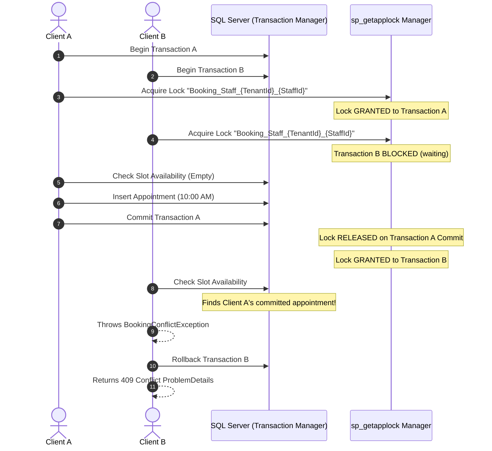

# BooklyHub — Scheduling Concurrency & Double-Booking Guard

## 1. The Concurrency Problem: Race Conditions in Booking

In high-volume booking platforms, multiple clients often attempt to book the exact same time slot simultaneously (e.g. popular doctors, Black Friday salon promotions).

Under default SQL Server `READ COMMITTED` isolation:
1. Client A queries availability for 10:00 AM ➔ Finds 0 bookings ➔ Evaluates slot as FREE.
2. Client B queries availability for 10:00 AM ➔ Finds 0 bookings ➔ Evaluates slot as FREE.
3. Client A inserts Appointment A for 10:00 AM ➔ Commits.
4. Client B inserts Appointment B for 10:00 AM ➔ Commits.
**Result: The doctor has been double-booked!**

---

## 2. BooklyHub's Solution: Fine-Grained Transactional Locking

BooklyHub implements a **fine-grained locking strategy** utilizing SQL Server's native `sp_getapplock` system procedure within an EF Core execution transaction:



---

## 3. Implementation Details

### 3.1 Lock Acquisition (`ApplicationDbContext.cs`)
```csharp
public async Task AcquireStaffLockAsync(Guid staffId, Guid tenantId, CancellationToken cancellationToken = default)
{
    if (Database.IsSqlServer())
    {
        var lockKey = $"Booking_Staff_{tenantId:N}_{staffId:N}";
        await Database.ExecuteSqlRawAsync(
            "DECLARE @res INT; EXEC @res = sp_getapplock @Resource = {0}, @LockMode = 'Exclusive', @LockOwner = 'Transaction', @LockTimeout = 15000; IF @res < 0 THROW 50000, 'Staff booking lock acquisition failed', 1;",
            [lockKey],
            cancellationToken);
    }
}
```

### 3.2 Key Advantages of This Architecture
1. **Zero False Contention**: Lock keys are granularly scoped to `TenantId` + `StaffId`. If 100 clients simultaneously book 100 different staff members, all 100 execute in **full parallel** with zero blocking.
2. **Deterministic Conflict Resolution**: Only the first transaction to acquire the lock reserves the slot. Subsequent transactions are unblocked, re-evaluate the now-occupied slot against fresh committed database state, and cleanly throw `BookingConflictException`.
3. **Deadlock Immunity**: Because transactions lock the staff member before querying any appointment tables, lock order is uniform and predictable, avoiding cyclic table deadlocks.
4. **Rescheduling Safety**: In `RescheduleAppointmentCommand`, the new slot is evaluated and locked within a transaction. If the target slot is unavailable, the transaction rolls back and the original appointment remains completely untouched.

---

## 4. Concurrency Test Verification

The integration test in `tests/BooklyHub.IntegrationTests/Concurrency/ConcurrentBookingTests.cs` validates this behavior against real SQL Server:
- **Test Scenario**: 5 distinct HTTP clients fire simultaneous `POST /api/v1/appointments` requests targeting the exact same staff member and 30-minute time slot.
- **Observed Result**:
  - `successCount`: Exactly **1** (HTTP 201 Created).
  - `conflictCount`: Exactly **4** (HTTP 409 Conflict).
  - Database verification confirms only a single appointment row exists for that slot.
