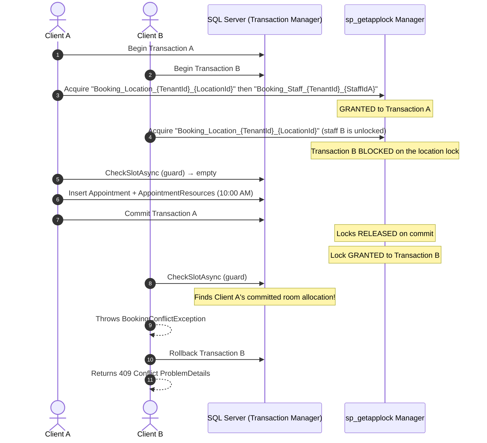

# BooklyHub — Scheduling Concurrency & Double-Booking Guard

## 1. The Concurrency Problem: Race Conditions in Booking

In high-volume booking platforms, multiple clients often attempt to book the exact same time slot simultaneously (e.g. popular doctors, Black Friday salon promotions).

Under default SQL Server `READ COMMITTED` isolation:
1. Client A queries availability for 10:00 AM ➔ Finds 0 bookings ➔ Evaluates slot as FREE.
2. Client B queries availability for 10:00 AM ➔ Finds 0 bookings ➔ Evaluates slot as FREE.
3. Client A inserts Appointment A for 10:00 AM ➔ Commits.
4. Client B inserts Appointment B for 10:00 AM ➔ Commits.
**Result: The doctor has been double-booked!**

---

## 2. BooklyHub's Solution: Two-Level Transactional Locking

BooklyHub serialises booking writes with SQL Server's native `sp_getapplock` inside an EF Core transaction, at **two levels**, always taken in the same order:

| Order | Lock key | Protects |
| --- | --- | --- |
| 1 | `Booking_Location_{TenantId}_{LocationId}` | rooms/equipment, which belong to the location and are shared by every staff member |
| 2 | `Booking_Staff_{TenantId}_{StaffId}` | one staff member's calendar |

A staff-scoped lock alone is not enough: two *different* staff members booking at the same minute do not contend with each other, yet they can be handed the same treatment room.



---

## 3. Implementation Details

### 3.1 Lock Acquisition (`ApplicationDbContext.cs`)
```csharp
public Task AcquireLocationBookingLockAsync(Guid tenantId, Guid locationId, CancellationToken cancellationToken = default)
    => ExecuteAppLockAsync($"Booking_Location_{tenantId:N}_{locationId:N}", cancellationToken);

public Task AcquireStaffLockAsync(Guid staffId, Guid tenantId, CancellationToken cancellationToken = default)
    => ExecuteAppLockAsync($"Booking_Staff_{tenantId:N}_{staffId:N}", cancellationToken);

private async Task ExecuteAppLockAsync(string lockKey, CancellationToken cancellationToken)
{
    if (!Database.IsSqlServer()) return;

    await Database.ExecuteSqlRawAsync(
        "DECLARE @res INT; EXEC @res = sp_getapplock @Resource = {0}, @LockMode = 'Exclusive', @LockOwner = 'Transaction', @LockTimeout = 15000; IF @res < 0 THROW 50000, 'Booking lock acquisition failed', 1;",
        [lockKey],
        cancellationToken);
}
```

`LockOwner = 'Transaction'` means no release path has to be written: committing or rolling back the surrounding transaction drops both locks.

### 3.2 One allocation authority

`IAvailabilityService.CheckSlotAsync` returns the resources it verified *and* allocated (`SlotCheckResult.ResourceIds`). The booking, reschedule and recurring commands persist exactly those ids; none of them picks a resource with its own query. Choosing a room outside the guard's lock is how two concurrent transactions both end up with the same one, and two implementations of "pick a free room" eventually disagree about buffers.

A recurring series validates all its occurrences in one call (`CheckSlotsAsync`), which loads the calendar once. Since nothing is committed yet, each accepted occurrence is replayed as a reservation for the ones after it, so a single request cannot hand itself the same minute or the same room twice.

### 3.3 Key Advantages of This Architecture
1. **Contention is scoped where the shared resource is**: keys are `TenantId`-qualified, so tenants never block each other, and bookings in different locations run in full parallel. Within one location, booking writes are serialised — that is the price of a correct shared-resource ledger, and the critical section is a few queries plus one insert.
2. **Deterministic Conflict Resolution**: Only the first transaction to acquire the lock reserves the slot. Subsequent transactions are unblocked, re-evaluate the now-occupied slot against fresh committed database state, and cleanly throw `BookingConflictException`.
3. **Deadlock Immunity**: Every path takes the location lock before the staff lock, and both are `@LockOwner = 'Transaction'`, so there is no cycle to form and no lock that can outlive its transaction. A starved waiter gives up after `@LockTimeout = 15000` ms and the request fails loudly rather than proceeding unlocked.
4. **Rescheduling Safety**: In `RescheduleAppointmentCommand`, the new slot is evaluated and locked within a transaction. If the target slot is unavailable, the transaction rolls back and the original appointment remains completely untouched. The room rows are rewritten from the guard's allocation, because the room held at the old time may belong to somebody else at the new one.

---

## 4. Concurrency Test Verification

Both tests run against real SQL Server and were each re-run with the fix reverted to confirm they fail for the right reason.

`tests/BooklyHub.IntegrationTests/Concurrency/ConcurrentBookingTests.cs`
- **Scenario**: 5 HTTP clients fire simultaneous `POST /api/v1/appointments` for the same staff member and 30-minute slot.
- **Result**: 1 Created, 4 Conflict, one appointment row in the database.

`tests/BooklyHub.IntegrationTests/Concurrency/ResourceContentionTests.cs`
- **Scenario**: 4 different staff members, one treatment room, same minute; then 3 staff with 3 rooms to prove the lock does not create false conflicts; then a recurring series whose room holdings must be visible to the next booking.
- **Result**: 1 Created and 3 Conflict; with enough rooms all 3 succeed and hold 3 distinct rooms; the series writes 3 `AppointmentResources` rows and a later booking into its room is refused.
- **Without the location lock**: all 4 attempts succeeded against the single room (4 × 201), and in the 3-room case two of the three appointments were handed the same room. With the recurring persistence removed, the series wrote 0 room rows.

`tests/BooklyHub.IntegrationTests/Appointments/NoShowClosureConcurrencyTests.cs`
- **Scenario**: the no-show sweep is interrupted by a second writer that commits in the gap between the sweep's candidate read and its status write. The writer is landed there deterministically — an interceptor fires the instant the candidate reader closes, and a `TOP 1 … ORDER BY EndAtUtc` update from another session writes the row the sweep had just put at the head of its batch.
- **Result**: a visit the staff marked `Completed` mid-sweep stays `Completed` with one history row; a visit rescheduled 20 days out stays `Confirmed`; the bookings beside either still close; `Closed` equals the rows stored as `NoShow`; and a tenant whose rows move on all three attempts is reported as deferred while the next tenant is still swept.
- **Without the re-judgement** (conflict allowed to propagate): all 7 fail, `Microsoft.EntityFrameworkCore.DbUpdateConcurrencyException : The database operation was expected to affect 1 row(s), but actually affected 0 row(s)` — and the exception escaping the tenant loop is what proves the writer landed after the read, since a conflict is unreachable otherwise.
- **With the batch's context reused across attempts**: 5 fail with `InvalidStateTransitionException : Transition from NoShow to NoShow is not permitted` — the entities were already moved in memory, so the retry judged its own stale work instead of the store's.
- **With the closure written as a set-based update** (immune to `RowVersion`, no token fired): the attended visit is restated as an absence (`Expected … Completed, but found … NoShow`), the rescheduled one is closed against a date that no longer exists, and the sweep's own `Closed` counts a booking the staff had already written (`Expected result.Closed to be 3 … but found 4`).

---

## 5. The no-show sweep: an optimistic guard instead of a lock

Everything above serialises writers that fight over one scarce slot. The closure sweep is the opposite shape: it reads up to 200 bookings, prices each against the payment ledger, and writes a status for the ones that are settled and unattended, every 15 minutes. Locking each appointment against the front desk for the length of that tick is the wrong trade, so the sweep takes **no lock on the rows it judges** and relies on two things instead.

1. **`Appointments.RowVersion`, configured with `IsRowVersion()`.** The sweep writes through the change tracker, so every closure is a compare-and-swap against the row the store holds rather than the row the sweep read. A staff member marking the visit `Completed` — or moving it to next week, which changes no status at all — makes the sweep's UPDATE match nothing and EF throws `DbUpdateConcurrencyException`. This is the whole of the data-integrity guarantee: an attended visit cannot be restated as an absence, and a rescheduled one cannot be closed against a date that has gone. A status re-check in the write's own `WHERE` would not cover the reschedule, because the status is the same.
2. **A re-judged batch, not a swallowed one.** The tenant's batch is one transaction, so the conflict rolls back *every* closure in it. `AppointmentNoShowBackgroundService` catches the conflict per tenant and re-reads that tenant from a **fresh** context, up to `MaxConflictAttempts = 3`. Each attempt takes the row that moved out of the next candidate read, so this is re-judgement rather than a retry that spins; past the bound the tenant counts as `SkippedContendedTenant` and the tenants behind it are still swept.

Three consequences are deliberate and are what the tests bind:

- **A fresh context per attempt is required, not tidy.** A rejected `SaveChanges` leaves its entities `Modified` and their in-memory status already `NoShow`; re-running on the same context re-walks those objects into `TransitionTo` and throws `InvalidStateTransitionException`. Re-judgement means reading the store again.
- **Reported counts describe committed rows.** The deferral returns `Closed = 0` for that tenant rather than the closures it rolled back, and `SkippedWithBalance` is re-derived from a ledger read taken in the same attempt as the write.
- **Unexpected failures stay loud.** Only `DbUpdateConcurrencyException` is caught. A deadlock or a timeout still propagates out of the tick and is logged by the worker, because a sweep that swallows every failure is a sweep nobody notices stop.

**Still open (SWP-02).** The token guards the appointment row, not the money judgement. A payment that commits after the sweep's ledger read and before its write touches no `Appointments` row, so no conflict is detected: measured on the current code, the sweep reported `Closed = 1` for a booking whose ledger showed one `Paid` row at the moment it was written. That visit is now a `NoShow`, which `PaymentLedger.ValidateCharge` refuses to charge, so the money has to be refunded instead of collected. Closing it means either taking `AcquireAppointmentPaymentLockAsync` per candidate — one lock per closure, inside a tick that holds the tenant's sweep lock — or re-asking the ledger in the same statement that writes the status, which means giving up the tracked save and, with it, the token above. That is a throughput decision against a correctness one, so it is recorded rather than made here.

