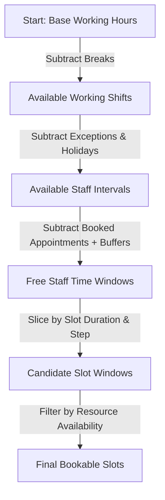

# BooklyHub — Scheduling & Availability Engine

## 1. Engine Design: Interval Algebra vs Brute Force

Traditional booking systems compute available slots by iterating minute-by-minute over the entire calendar day (e.g., checking 10:00, 10:01, 10:02...). For busy multi-staff clinics or gyms, this brute-force approach leads to severe CPU thrashing and unbounded database roundtrips.

**BooklyHub** employs a deterministic **Interval-Based Scheduling Engine (`IAvailabilityService`)** powered by pure interval algebra (`TimeInterval`):

---

## 2. Core Availability Components

### 2.1 Interval Algebra (`TimeInterval.cs`)
An interval represents a half-open time range `[Start, End)`. The scheduling engine operates on collections of intervals:
- **`Subtract(busyInterval)`**: Cuts a busy period out of a free window, potentially splitting one free window into two smaller windows.
- **`OverlapsWith(other)`**: `Start < other.End && End > other.Start`.
- **`Duration`**: `End - Start`.

### 2.2 Buffer Times (`BufferBefore` & `BufferAfter`)
Services frequently require prep or cleanup periods (e.g., 10 minutes room sterilization for a dental procedure). When an appointment is booked from `10:00` to `10:30` with `BufferBefore = 5` and `BufferAfter = 10`, the scheduling engine treats the staff member as unavailable from `09:55` to `10:40`.

### 2.3 Shared Resource Constraints
A service can require one or more physical resources from a `ResourceGroup` (e.g., a "Treatment Room" or "Ultrasound Machine"):
1. The engine checks staff availability first.
2. For each candidate time slot, it verifies whether at least `QuantityRequired` active units in the required `ResourceGroup` are unallocated during that exact window.
3. If no resource is free, the slot is pruned from the result.

---

## 3. Daylight Saving Time (DST) & Timezone Safety

All internal database timestamps (`StartAtUtc`, `EndAtUtc`, `CreatedAtUtc`) are stored strictly in **UTC**.

The columns are `datetime2`, which stores the ticks it is handed and converts nothing, so the label a value carries on
the way in is the only thing that says which instant it is. `BL-05` closed that gap at the edge: `UtcInstant.cs` reads
every inbound instant as UTC — an explicit offset is converted back, a value with no designator is taken as the zone
its own field name names — and `Appointment.Create` / `Appointment.Reschedule` refuse a value still labeled for a
machine's zone with the rule `InvalidDateKind`. What is *inside* the engine keeps the opposite convention: the
availability guard builds candidate times from a staff member's local calendar as `Kind=Unspecified` and converts them
with `TimeZoneHelper`, so a refusal there would refuse every booking. The narrowness is the point — `Local` is the one
label that means "these ticks belong to somebody's zone".

However, business hours and booking rules are defined in the tenant's or location's **local time zone** (e.g., `America/New_York` or `Europe/London`):

### Conversion Workflow (`TimeZoneHelper.cs`)
1. User requests availability for Date `2026-10-25` in `America/New_York`.
2. The engine resolves `TimeZoneInfo.FindSystemTimeZoneById("America/New_York")`.
3. Shift intervals (e.g. `09:00 - 17:00`) are mapped to local `DateTime` instances on `2026-10-25`.
4. `TimeZoneInfo.ConvertTimeToUtc` converts the shift boundaries to UTC, automatically applying standard/daylight offsets for that specific calendar date.
5. In the event of an ambiguous or invalid local time (e.g. the 1-hour fall-back transition or spring-forward gap), the `TimeZoneHelper` applies deterministic mapping without throwing runtime exceptions.
