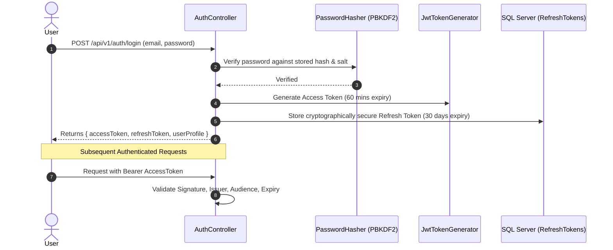

# BooklyHub — Security & Authorization Architecture

## 1. Authentication Engine

BooklyHub implements a secure token-based authentication architecture combining short-lived JSON Web Tokens (JWT) with database-backed rotating refresh tokens:



### 1.1 Password Security (PBKDF2)
Passwords are never stored in plaintext or weak cryptographic hashes (MD5, SHA1). The `PasswordHasher` uses **PBKDF2 with HMAC-SHA256**:
- **Salt**: 16 bytes (128-bit) cryptographically random salt generated via `RandomNumberGenerator`.
- **Iterations**: 100,000 iterations.
- **Output Key**: 32 bytes (256-bit) subkey.
- **Constant-Time Verification**: `CryptographicOperations.FixedTimeEquals` prevents timing attacks.

### 1.2 Sliding Refresh Token Rotation
- Refresh tokens are hashed and stored with `ExpiresAtUtc`, `CreatedByIp`, and `RevokedAtUtc`.
- Each refresh token redemption generates a new replacement refresh token and revokes the old one, neutralizing stolen token replays.

---

## 2. Granular Permission-Based Authorization (RBAC)

Rather than hardcoding coarse roles in controller actions (`[Authorize(Roles = "Admin")]`), BooklyHub employs a granular **Permission-Based Authorization System**:

### 2.1 Role Hierarchy & Permissions
| Role | Capabilities |
| :--- | :--- |
| **`PlatformAdmin`** | System-wide configuration, tenant onboarding, cross-tenant maintenance. |
| **`TenantOwner`** | Full control over tenant settings, billing, locations, staff, and services. |
| **`TenantAdmin`** | Manage staff rosters, service pricing, reports, and appointments. |
| **`Manager`** | Schedule staff shifts, approve refunds, manage reviews. |
| **`Staff`** | View personal calendar, transition appointment statuses, add customer notes. |
| **`Receptionist`** | Check in customers, reschedule appointments, collect payments. |

### 2.2 Declarative Permission Attributes
Controllers use the `[HasPermission]` attribute:
```csharp
[HttpPost]
[HasPermission(Permissions.Appointments.Create)]
public async Task<IActionResult> BookAppointment(...)
```

The `PermissionAuthorizationHandler` checks the user's combined permissions loaded during authentication or dynamically checked against `RolePermissions`.

---

## 3. Rate Limiting & Defense-in-Depth

### 3.1 Rate Limiting Middleware
Configured in `Program.cs` via ASP.NET Core's built-in `RateLimiter`:
- **General Endpoints**: Sliding window limiter (100 requests per minute per IP).
- **Authentication Endpoints**: Strict fixed window limiter (10 login attempts per minute per IP) to prevent brute-force credential stuffing.

### 3.2 Automated Request Validation
All CQRS commands pass through MediatR's `ValidationBehavior<TRequest, TResponse>` backed by **FluentValidation**:
- Requests containing malformed inputs, past dates, or invalid email formats fail *before* database transactions or domain logic can execute.
- Prevents SQL injection and invalid state transitions at the gateway boundary.
