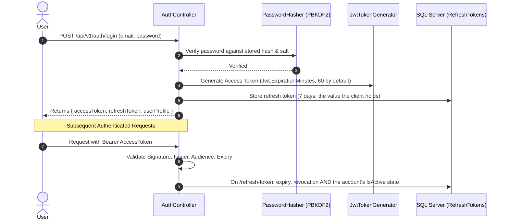

# BooklyHub — Security & Authorization Architecture

## 1. Authentication Engine

BooklyHub implements a secure token-based authentication architecture combining short-lived JSON Web Tokens (JWT) with database-backed rotating refresh tokens:



### 1.1 Password Security (PBKDF2)
Passwords are never stored in plaintext or weak cryptographic hashes (MD5, SHA1). The `PasswordHasher` uses **PBKDF2 with HMAC-SHA256**:
- **Salt**: 16 bytes (128-bit) cryptographically random salt generated via `RandomNumberGenerator`.
- **Iterations**: 100,000 iterations.
- **Output Key**: 32 bytes (256-bit) subkey.
- **Constant-Time Verification**: `CryptographicOperations.FixedTimeEquals` prevents timing attacks.

### 1.2 Sliding Refresh Token Rotation
- Refresh tokens are stored with `ExpiresAtUtc`, `RevokedAtUtc` and `ReplacedByToken`. (Not hashed, not with `CreatedByIp` — this section claimed both until it was checked against the entity; hashing them at rest is `SEC-05`, and the column today holds the value a client sends.)
- Each refresh token redemption generates a new replacement refresh token and revokes the old one, neutralizing stolen token replays.
- **The account is re-checked on every redemption** (`ACT-01`). A refresh token is a seven-day credential, so `IsActive` cannot be a rule of the login box alone: without it, switching a user off changed nothing for the tokens that user already held. Redemption now refuses a deactivated account with the same body it uses for a token that was never issued, expired or revoked — the refusal does not announce that an account was disabled. A soft-deleted account needs no term in the controller: the global `!IsDeleted` filter makes its user arrive as `null`, which the same condition already refuses.
- What that does **not** do: an **access token already minted** keeps working until it expires — measured at `200` on `/api/v1/auth/me` for a deactivated account holding the token it got before the switch-off. The window is the access token's own life, 60 minutes at the shipped `Jwt:ExpirationMinutes`. Closing it means a revocation claim or a per-request account read, which is `SEC-05`'s missing revocation path, not this section's.

---

## 2. Granular Permission-Based Authorization (RBAC)

Rather than hardcoding coarse roles in controller actions (`[Authorize(Roles = "Admin")]`), BooklyHub employs a granular **Permission-Based Authorization System**:

### 2.1 Role Hierarchy & Permissions
| Role | Capabilities |
| :--- | :--- |
| **`PlatformAdmin`** | System-wide configuration, tenant onboarding, cross-tenant maintenance. |
| **`TenantOwner`** | Full control over tenant settings, billing, locations, staff, and services. |
| **`TenantAdmin`** | Manage staff rosters, service pricing, reports, and appointments. |
| **`Manager`** | Schedule staff shifts, approve refunds, manage reviews. |
| **`Staff`** | View personal calendar, transition appointment statuses, add customer notes. |
| **`Receptionist`** | Check in customers, reschedule appointments, collect payments. |

### 2.2 Declarative Permission Attributes
Controllers use the `[HasPermission]` attribute:
```csharp
[HttpPost]
[HasPermission(Permissions.Appointments.Create)]
public async Task<IActionResult> BookAppointment(...)
```

The `PermissionAuthorizationHandler` checks the user's combined permissions loaded during authentication or dynamically checked against `RolePermissions`.

---

## 3. Rate Limiting & Defense-in-Depth

### 3.1 Rate Limiting Middleware
Configured in `Program.cs` through ASP.NET Core's built-in `RateLimiter`. Three fixed-window partitions, every one with `QueueLimit = 0` so an over-budget request is refused at once rather than held in a queue until the window turns:

- **General traffic**: 100 requests per minute per peer address.
- **Authentication endpoints** (`POST /api/v1/auth/login`, `POST /api/v1/auth/refresh-token`): 10 requests per minute per peer address, applied with `[EnableRateLimiting("auth")]` on top of the general budget.
- **Health probes** (`/health`, `/health/live`, `/health/ready`): 120 per minute instance-wide, in a partition of their own.

Every refusal answers with the standard problem envelope and a `Retry-After` header.

This section used to describe a limiter that did not exist. It claimed a *sliding* window for general traffic (the code has always been fixed-window) and a "strict fixed window limiter (10 login attempts per minute per IP)" for authentication (no such policy was ever registered — `grep` for `AddPolicy`/`EnableRateLimiting` returned nothing). Measured against the real pipeline before the fix: fifteen consecutive wrong-password logins were answered `401, 401, 401…`, ninety-five requests on any path left exactly five permits for the login box, and a sequential caller over budget was never refused at all — it sat in the 10-deep queue and was re-permitted seconds later, which also parked authenticated desk requests past five seconds with no status and answered `GET /health` with a `429`.

What these tiers deliberately do **not** protect against, stated so nobody reads them as more than they are:

- **The key is the address, not the account.** A limiter counts requests and cannot know whether one failed, so ten per minute is ten *attempts*, legitimate ones included. A clinic whose twenty staff sign in from one office address inside a minute will see the eleventh refused. The real defence against a targeted account is failure counting with backoff, which needs columns on `Users` and is tracked as `SEC-04`'s remaining half.
- **Behind a reverse proxy, the address is the proxy's.** Nothing in `src` calls `UseForwardedHeaders`, so partitioning on `Connection.RemoteIpAddress` collapses every user into a single bucket the moment a proxy sits in front. `docker-compose.yml` publishes `127.0.0.1:5000:8080`, so any remote client already reaches the instance through something; an operator choosing that shape must configure forwarded headers *and* trust the proxy that sets them.
- **Nothing records or locks out a failing account.** That is `SEC-04(b)`, and it needs failure columns on `Users`.
- **The login body no longer distinguishes anything, but its timing still does.** It used to answer "User account has been deactivated." where every other refusal says "Invalid email or password." — that was the whole of the remaining existence oracle in the body, and the three reasons (no such user, wrong password, inactive account) now answer field-for-field identically. What no wording hides: an unknown address never reaches the PBKDF2 hash (~0.8 ms measured) while a known one costs ~50–80 ms, so a caller who can time the response still learns whether the address exists. Closing that means verifying a dummy hash on the missing-user branch, which charges the same cost to every guess — a decision, not a default, and deliberately not taken here.


### 3.2 Automated Request Validation
All CQRS commands pass through MediatR's `ValidationBehavior<TRequest, TResponse>` backed by **FluentValidation**:
- Requests containing malformed inputs, past dates, or invalid email formats fail *before* database transactions or domain logic can execute.
- Prevents SQL injection and invalid state transitions at the gateway boundary.

### 3.3 Every Denial Answers in the Same Shape
A `401` from the JWT challenge, a `403` from the permission handler, a `404` for a path with no endpoint and a `429` from the limiter used to travel as a bare status code — no content type, no body — while anything thrown inside an action carried a problem document. The gap is not cosmetic: a client cannot show or log what it was refused for, and a refused request whose body is empty cannot be tied to a log line at all.

Both paths now write `application/problem+json` carrying `status`, `title`, `instance` and `correlationId` (the full field table is in `API.md` §1.1). Note what this did **not** involve: `ExceptionHandlingMiddleware` was measured to be the *outermost* boundary over authentication, tenant resolution, authorization and idempotency, so those requests were never outside its reach and moving the boundary would have changed nothing. The missing piece was a writer for the statuses that no action produces.

A third producer had to be fixed where it stood, because no middleware reaches it: an action that refuses **without throwing**. `POST /api/v1/auth/login` and `POST /api/v1/auth/refresh-token` returned `Unauthorized(new { message })`, which is an `ObjectResult`, so they answered `application/json` with one lowercase field — a client parsing the envelope found nothing to parse, and the correlation id that support asks for was in the header but not in the body. They now answer through `ControllerBase.Problem` and the same problem-details service, so a failed sign-in carries `type` and `traceId` like the pipeline path and `detail` like the action path (`ENV-01`, closed for the auth endpoints by this section). The same `new { message = … }` shape is still returned by seven `BadRequest` guards in the controllers (`ReviewsController`, `ReportsController`, `AvailabilityController` and four in `CatalogControllers`) — that is the open residue of `ENV-01`, listed in `API.md` §1.1.
